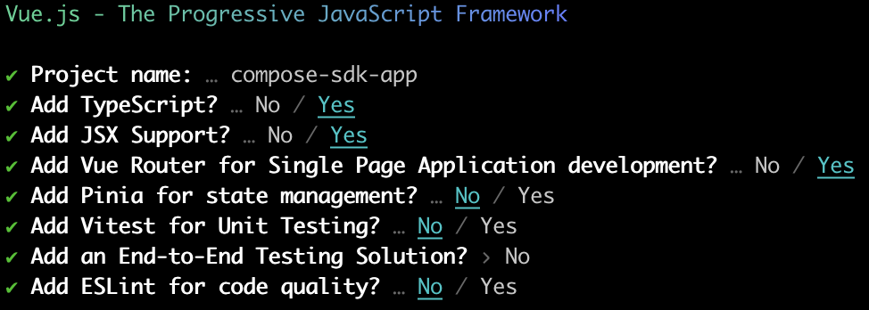

# Compose SDK with Vue <Badge type="beta" text="Beta" />: Quickstart Guide

Follow this guide to get started developing applications with Compose SDK.

> **Note**:
> This guide is for [ Vue](./quickstart-vue.md) (beta). We also have a Quickstart Guide for [ React](./quickstart.md) and [ Angular](./quickstart-angular.md) (beta).

## Prerequisites

Compose SDK contains a set of components needed to interface with your Sisense instance. The following prerequisites are needed in order to use the SDK:

1. Familiarity with [front-end web development](https://developer.mozilla.org/en-US/docs/Learn/Front-end_web_developer), including Node.js, JavaScript/TypeScript, and Angular.
2. [Node.js](https://nodejs.org/en) version **18.0.0** or higher.
3. [Vue](https://vuejs.org) version **3.3.0** or higher.
4. A Node package manager such as [npm](https://docs.npmjs.com/downloading-and-installing-node-js-and-npm) or [Yarn](https://yarnpkg.com/getting-started/install).
5. Access to a [Sisense](https://sisense.com) instance with a queryable data source (for example, Sample Retail).
6. Vue application **with TypeScript**. You can use an existing application, or if you don't have one, you can follow the [tutorial](https://vuejs.org/guide/quick-start) to create one.

## Quickstart Application Setup

For this quickstart guide we'll create a new Vue project using [comand line tool](https://vuejs.org/guide/quick-start#creating-a-vue-application).

If you're using an existing project, skip to [Installing the SDK packages](#installing-the-sdk-packages).

1. Create or navigate to the directory in which you want to create your Vue app.

2. Run this command to create your new Vue app.

<div style="display: flex; margin-right: 10px;">
  <div style="flex: 1; overflow-x: auto; max-width: calc(50% - 5px);">

For npm:

```sh
npm create vue@latest
```

  </div>
  <div style="flex: 1; margin-left: 10px; overflow-x: auto; max-width: calc(50% - 5px);">

For Yarn:

```sh
yarn create vue@latest
```

  </div>
</div>

3. When prompted, choose to add Typescript, JSX support and Vue routing.



This creates a new Vue app in the `compose-sdk-app` directory.

4. Run this command to navigate to the newly created directory.

```sh
cd compose-sdk-app
```

5. Install the dependencies.

<div style="display: flex; margin-right: 10px;">
  <div style="flex: 1; overflow-x: auto; max-width: calc(50% - 5px);">

For npm:

```sh
npm install
```

  </div>
  <div style="flex: 1; margin-left: 10px; overflow-x: auto; max-width: calc(50% - 5px);">

For Yarn:

```sh
yarn
```

  </div>
</div>

6. To run the application, use:

<div style="display: flex; margin-right: 10px;">
  <div style="flex: 1; overflow-x: auto; max-width: calc(50% - 5px);">

For npm:

```sh
npm run dev
```

  </div>
  <div style="flex: 1; margin-left: 10px; overflow-x: auto; max-width: calc(50% - 5px);">

For Yarn:

```sh
yarn dev
```

  </div>
</div>

## Installing the SDK Packages

Compose SDK for Vue contains three packages for public use:

-   [@sisense/sdk-ui-vue](https://www.npmjs.com/package/@sisense/sdk-ui-vue): Vue components and hooks for rendering charts and executing queries against a Sisense instance.
-   [@sisense/sdk-data](https://www.npmjs.com/package/@sisense/sdk-data): Implementations of dimensional modeling elements including dimensions, attributes, measures, and filters.
-   [@sisense/sdk-cli](https://www.npmjs.com/package/@sisense/sdk-cli): A command-line tool for generating a TypeScript representation of a Sisense data model.

The Compose SDK packages are deployed via public NPM Registry. To install `@sisense/sdk-ui-vue` and `@sisense/sdk-data` for your app:

<div style="display: flex; margin-right: 10px;">
  <div style="flex: 1; overflow-x: auto; max-width: calc(50% - 5px);">

For npm:

```sh
npm i @sisense/sdk-ui-vue @sisense/sdk-data
```

  </div>
  <div style="flex: 1; margin-left: 10px; overflow-x: auto; max-width: calc(50% - 5px);">

For Yarn:

```sh
yarn add @sisense/sdk-ui-vue @sisense/sdk-data
```

  </div>
</div>

Package `@sisense/sdk-cli` is not needed to run your app. It will be installed on the fly as you execute CLI commands using [npx](https://docs.npmjs.com/cli/v10/commands/npx).

## Sisense Authentication and Security

In order to retrieve data, you need to authenticate your application with your Sisense instance and set up CORS.

### Authentication

There are a number of different ways you can authenticate your application. To learn more, see [Authentication and Security](./authentication-security.md#authentication).

Here, we'll use an API Token that we retrieve using the Compose SDK tool. To do so, run the `get-api-token` command:

```sh
npx @sisense/sdk-cli@latest get-api-token --url <your_instance_url> --username <username>
```

Hold on to the API Token. You'll need it later when adding Compose SDK code to your application.

### CORS Settings

There are also a number of different ways you can set up CORS. To learn more, see [Authentication and Security](./authentication-security.md#cross-origin-resource-sharing-cors).

Here we'll use the Sisense UI. To do so, in your Sisense instance, go to **Admin > Security & Access > Security Settings > General** and add your application's domain to the **CORS Allowed Origins** list.

## Adding Sisense to Your Application

This section describes how to add Compose SDK to your application to render charts from data in your Sisense instance.

### Generating a Data Model Representation

To visualize data in your application using Compose SDK, first make sure you have a data model in your Sisense instance. Then, create a TypeScript representation of it in your project. This is done using the CLI command which automatically generates it, or you can create it manually using the same syntax.

Once you have a TypeScript representation of your data model, you define measures, dimensions and filters and easily create sophisticated queries. There is no need to specify complex `JOINS` relationships or `GROUP BYS` that you do when using SQL and other query languages because the Sisense semantic query engine will do that for you.

Run the following command to create a `sample-retail.ts` file in directory `src/` of the application. The file contains a TypeScript representation of the Sample Retail data model.

```sh
npx @sisense/sdk-cli@latest get-data-model --username "<username>" --output src/sample-retail.ts --dataSource "Sample Retail" --url <your_instance_url>
```

Enter your password to complete the command and generate the data model representation.

> **Note:**
> You can use other authentication methods such as WAT (`--wat "<your_token>"`), or API token (`--token "<your_API_token>"`) when generating the data model representation.

The resulting file, which is created in the `src/` directory, should look something like below:

```ts
import type { Dimension, DateDimension, Attribute } from '@sisense/sdk-data';
import { createAttribute, createDateDimension, createDimension } from '@sisense/sdk-data';

export const DataSource = 'Sample Retail';

interface DimCountriesDimension extends Dimension {
  CountryName: Attribute;
  Region: Attribute;
}
export const DimCountries = createDimension({
  name: 'DimCountries',
  CountryName: createAttribute({
    name: 'CountryName',
    type: 'text-attribute',
    expression: '[DimCountries.CountryName]',
  }),
  Region: createAttribute({
    name: 'Region',
    type: 'text-attribute',
    expression: '[DimCountries.Region]',
  }),
}) as DimCountriesDimension;
...
```

This works for any data model, including models you create. Just replace `"Sample Retail"` with the name of your data model.

## Embedding a Chart in your Application

In this section, you will add a new component and modify the main app to embed a chart visualizing data from the Sample Retail data source.

> **Note:**
> The following assumptions are made about your application:
>
> -   The `src/App.vue` file is the main Vue component.
> -   The `sample-retail.ts` file generated earlier resides in `src/`.
> -   The URL to your application (f.e. http://localhost:5173) is already added as an entry to CORS Allowed Origins section on your Sisense instance

### Connecting to a Sisense Instance

The `SisenseContextProvider` component contains all relevant information about the Sisense instance and ensures it is available to all nested Compose SDK components. In other words, this is a wrapper for your application so that all the components are able to access the data. The authentication method used to access your Sisense instance is also defined in this component.

The following examples shows how to add `SisenseContextProvider` to `src/App.vue`. Make sure that all the other SDK components you want to use are nested inside the `SisenseContextProvider` component.

```ts
// src/App.vue

<script setup lang="ts">
import { SisenseContextProvider } from '@sisense/sdk-ui-vue';
</script>

<template>
  <SisenseContextProvider
    url="<instance url>"
    token="<api token>"
  >
  </SisenseContextProvider>
</template>
```

> **Note:**
> The above example uses the API token (also called _bearer authentication_) to connect to a Sisense instance. To generate an API token for your Sisense user account, see the Sisense Instance Authentication section above. The `SisenseContextProvider` also supports other authentication mechanisms including WAT and SSO.

### Adding a chart

To render a chart in your application that queries your data model, use the `Chart` component, the `measureFactory` and `filterFactory` utilities, and your previously generated data model file.

Use the `dataOptions` property (`ChartProps` interface) to assign table columns or attributes from your data model to the categories and values of a chart. This is similar to the **Data** panel in the **Sisense Widget Editor**, where you can drag and drop columns to the **Categories**, **Values**, and **Break By** fields. For example, if you wanted to render a column chart with `Category Name` on the X-axis and an average aggregation of `Unit Price Discount` on the Y-axis, your `dataOptions` object would look like:

```ts
// chartType={'column'}
{
    category: [DM.DimProducts.CategoryName],
    value: [measureFactory.average(DM.Fact_Sale_orders.UnitPriceDiscount)],
    breakBy: [],
  }
```

> **Note:**
> Use `measureFactory.average()` from the example above to specify the `average` type aggregation on the `UnitPriceDiscount` category. This `measureFactory` utility is exported from the `@sisense/sdk-data` library and supports other aggregation types. See the [`measureFactory`](../modules/sdk-data/factories/namespace.measureFactory/index.md) documentation for more information.

The following is a complete example of a rendered chart in an application.

```ts
// src/App.vue

<script setup lang="ts">
import { SisenseContextProvider } from '@sisense/sdk-ui-vue';
import { Chart } from '@sisense/sdk-ui-vue';
import { measureFactory } from '@sisense/sdk-data';

import * as DM from './sample-retail';
</script>

<template>
  <SisenseContextProvider
    url="<instance url>"
    token="<api token>"
  >
    <Chart
      chartType="column"
      :dataSet="DM.DataSource"
      :dataOptions="{
        category: [DM.DimProducts.CategoryName],
        value: [measureFactory.average(DM.Fact_Sale_orders.UnitPriceDiscount, 'Average Discount')],
      }"
    />
  </SisenseContextProvider>
</template>
```

At this point, check your application in the browser if it's already running or run your application as described in [Quickstart Application Setup](#quickstart-application-setup).

Your first Compose SDK chart with Vue should look something like this:


See the [SisenseContextProvider](../modules/sdk-ui-vue/contexts/class.SisenseContextProvider.md) and [Chart](../modules/sdk-ui-vue/charts/class.Chart.md) docs for more details on supported props.

## Next Steps

The sample application in this quickstart guide is designed to give you a basis for what you can do with Compose SDK. Build on the code sample by using other components from Compose SDK to add Sisense analytical experiences to your applications.
