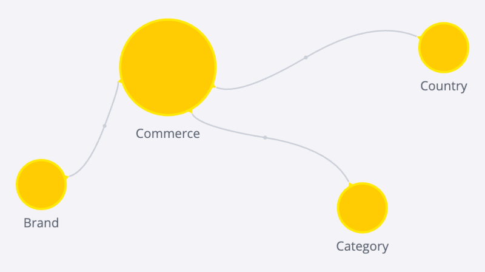

# Data Model

When using Compose SDK with data from a Sisense instance, you can use a TypeScript representation of your data model to easily reference the entities in your model. Although it’s not strictly necessary to use a TypeScript data model representation, using one will save you time and help minimize errors in your code.

TypeScript representations of Sisense data models are built using functionality provided in the `sdk-data` module of Compose SDK.

Typically, these data model representations are built using the Compose SDK CLI tool. The CLI tool reads a specified data model from your Sisense instance and uses the functionality of the `sdk-data` module to build your data model using TypeScript. The end result is a TypeScript file that exports your data model’s structure. You can then import the data model from that file and use it in your code.

Theoretically, you can manually create a TypeScript representation of a Sisense data model using the functions exposed in `sdk-data`, but the need to do so is exceptionally rare. You may, however, want to edit the generated model to add sort on an attribute for example.

## Generating a Data Model

To generate a TypeScript representation of a Sisense data model use the Compose SDK CLI tool’s `get-data-model` command.

The command takes the following parameters:

+ `--output`: Relative path in which to create the data model TypeScript file
+ `--dataSource`: Name of the data model in the Sisense instance
+ `--url`: URL of the Sisense instance
+ `--username`: (Optional) A username in the Sisense instance
+ `--wat`: (Optional) Web access token to use for authentication
+ `--token`: (Optional) An API token to use for authentication

For example, you can create a TypeScript representation of the Sample ECommerce data model like this:

```sh
npx @ethings-os/sdk-cli@latest get-data-model --username sample@sample.com --output src/sample-ecommerce.ts --dataSource "Sample ECommerce" --url https://myinstanceurl.com
```

If prompted, enter your password to authenticate and generate the data model representation.

## Data Model Contents

A TypeScript representation of a Sisense data model includes a data source name, type information and information about the dimensions and attributes of your data model.

Each table in your data model is represented by an exported dimension, which itself is made up of multiple attributes, representing the fields in the table.

For example, consider the Sample Ecommerce data model:



This model generates the following TypeScript representation. Note that the `Brand` dimension represents the Brand table and the `Brand` and `BrandID` attributes represent fields in the Brand table with those names. Each attribute is created using `name`, `type`, and `expression` values.

```ts
import {
  Dimension,
  DateDimension,
  Attribute,
  createAttribute,
  createDateDimension,
  createDimension,
} from '@ethings-os/sdk-data';

export const DataSource = 'Sample ECommerce';

interface BrandDimension extends Dimension {
  Brand: Attribute;
  BrandID: Attribute;
}
export const Brand = createDimension({
  name: 'Brand',
  Brand: createAttribute({
    name: 'Brand',
    type: 'text-attribute',
    expression: '[Brand.Brand]',
  }),
  BrandID: createAttribute({
    name: 'BrandID',
    type: 'numeric-attribute',
    expression: '[Brand.Brand ID]',
  }),
}) as BrandDimension;

// Additional interface definitions and dimensions with attributes
// for the Category, Commerce, and Country tables
```

## Using a Data Model

Once you’ve created a TypeScript data model representation, you can import and use it in code that refers to that data model. You can use it when creating visualizations, such as charts and tables, or when performing queries.

For example here is a chart that uses an imported data model representation to define its `dataset` and `dataOptions`.

```ts
import * as DM from '../sample-ecommerce';
import { measureFactory } from '@ethings-os/sdk-data';

//...

<Chart
  chartType={'column'}
  dataSet={DM.DataSource}
  dataOptions={{
    category: [DM.Commerce.AgeRange],
    value: [measureFactory.sum(DM.Commerce.Revenue)],
  }}
  styleOptions={{ width: 800, height: 400 }}
/>
```

And here is an example of performing a query using a data model representation, including sorting one of the attributes:

```ts
import * as DM from '../sample-ecommerce';
import { Sort, measureFactory } from '@ethings-os/sdk-data';

//...

const { data, isLoading, isError } = useExecuteQuery({
  dataSource: DM.DataSource,
  dimensions: [DM.Commerce.AgeRange.sort(Sort.Descending)],
  measures: [measureFactory.sum(DM.Commerce.Revenue)],
});
```
