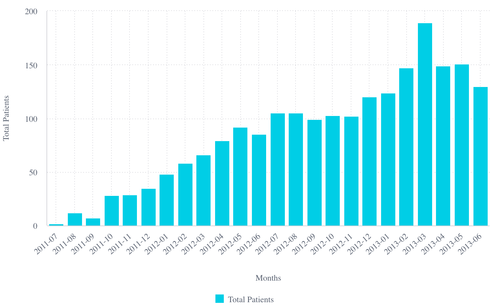

# Class ChartComponent

An Angular component used for easily switching chart types or rendering multiple series of different chart types.

## Example

An example of using the `Chart` component to
plot a column chart of the Sample Healthcare data source hosted in a Sisense instance:

```html
<!--Component HTML template in .component.html-->
<csdk-chart
  [chartType]="chart.chartType"
  [dataSet]="chart.dataSet"
  [dataOptions]="chart.dataOptions"
  [filters]="chart.filters"
  [styleOptions]="chart.styleOptions"
/>
```

```ts
// Component behavior in .component.ts
chart = {
  chartType: 'column' as ChartType,
  dataSet: DM.DataSource,
  dataOptions: {
    category: [DM.Admissions.Admission_Time.Months],
    value: [measureFactory.count(DM.Admissions.Patient_ID, 'Total Patients')],
    breakBy: [],
  },
  filters: [filterFactory.members(DM.Doctors.Specialty, ['Oncology', 'Cardiology'])],
  styleOptions: {
    width: 800,
    height: 500,
    xAxis: {
      title: {
        text: 'Months',
        enabled: true,
      },
    },
    yAxis: {
      title: {
        text: 'Total Patients',
        enabled: true,
      },
    },
  },
};
```



## Implements

- `AfterViewInit`
- `OnChanges`
- `OnDestroy`

## Constructors

### constructor

> **new ChartComponent**(`sisenseContextService`, `themeService`): [`ChartComponent`](class.ChartComponent.md)

Constructor for the `Chart` component.

#### Parameters

| Parameter | Type | Description |
| :------ | :------ | :------ |
| `sisenseContextService` | [`SisenseContextService`](../contexts/class.SisenseContextService.md) | Sisense context service |
| `themeService` | [`ThemeService`](../contexts/class.ThemeService.md) | Theme service |

#### Returns

[`ChartComponent`](class.ChartComponent.md)

## Properties

### Data

#### dataSet

> **dataSet**: [`Data`](../../sdk-data/interfaces/interface.Data.md) \| [`DataSource`](../../sdk-data/type-aliases/type-alias.DataSource.md) \| `undefined`

Data set for a chart using one of the following options. If neither option is specified, the chart
will use the `defaultDataSource` specified in the parent `SisenseContextProvider`
component.

(1) Sisense data source name as a string. For example, `'Sample ECommerce'`. Typically, you
retrieve the data source name from a data model you create using the `get-data-model`
[command](https://sisense.dev/guides/sdk/guides/cli.html) of the Compose SDK CLI. Under the hood, the chart
connects to the data source, executes a query, and loads the data as specified in
`dataOptions`, `filters`, and `highlights`.

To learn more about using data from a Sisense data source, see the
[Compose SDK Charts Guide](/guides/sdk/guides/charts/guide-compose-sdk-charts.html#sisense-data).

OR

(2) Explicit [`Data`](../../sdk-data/interfaces/interface.Data.md), which is made up of an array of
[`Column`](../../sdk-data/interfaces/interface.Column.md) objects and a two-dimensional array of row data. This approach
allows the chart component to be used with any data you provide.

To learn more about using data from an external data source, see the
[Compose SDK Charts Guide](/guides/sdk/guides/charts/guide-compose-sdk-charts.html#explicit-data).

Example data in the proper format:

```ts
const sampleData = {
  columns: [
    { name: 'Years', type: 'date' },
    { name: 'Quantity', type: 'number' },
    { name: 'Units', type: 'number' },
  ],
  rows: [
    ['2019', 5500, 1500],
    ['2020', 4471, 7000],
    ['2021', 1812, 5000],
    ['2022', 5001, 6000],
    ['2023', 2045, 4000],
  ],
};
```

***

#### filters

> **filters**: [`FilterRelations`](../../sdk-data/interfaces/interface.FilterRelations.md) \| [`Filter`](../../sdk-data/interfaces/interface.Filter.md)[] \| `undefined`

Filters to limit (or slice) a chart’s data using one of the following options.

(1) Array of [Filter](../../sdk-data/interfaces/interface.Filter.md) or [FilterRelations](../../sdk-data/interfaces/interface.FilterRelations.md) returned from filter factory functions, such as
[`greaterThan()`](../../sdk-data/factories/namespace.filterFactory/functions/function.greaterThan.md) and [`members()`](../../sdk-data/factories/namespace.filterFactory/functions/function.members.md).

Use this option for filters that do not require a UI to set them
or for filters where you will supply your own UI components or use pre-built UI components. This is the most common option.

To learn more about using filter factory functions to create filters, see the [Compose SDK Charts Guide](/guides/sdk/guides/charts/guide-compose-sdk-charts.html#filter-functions).

(2) Array of [Filter](../../sdk-data/interfaces/interface.Filter.md) controlled by filter UI components – for example [MemberFilterTile](../../sdk-ui/filter-tiles/function.MemberFilterTile.md).

Use this option for filters that you want your users to set using pre-built UI components.

To learn more about using filter UI components to create filters, see the [Compose SDK Charts Guide](/guides/sdk/guides/charts/guide-compose-sdk-charts.html#filter-components).

***

#### highlights

> **highlights**: [`Filter`](../../sdk-data/interfaces/interface.Filter.md)[] \| `undefined`

Highlights based on filter criteria to apply to a chart using one of the following options.

NOTE that the filter dimensions used in highlights must match those defined in the
`dataOptions` of the chart. Otherwise, the filters will be applied as regular slice filters.

(1) Array of [Filter](../../sdk-data/interfaces/interface.Filter.md) returned from filter factory functions, such as
[`greaterThan()`](../../sdk-data/factories/namespace.filterFactory/functions/function.greaterThan.md) and [`members()`](../../sdk-data/factories/namespace.filterFactory/functions/function.members.md).

Use this option for highlights that do not require a UI to set them
or for highlights where you will supply your own UI components or use pre-built UI components. This is the most common option.

To learn more about using filter factory functions to create highlights, see the
[Compose SDK Charts Guide](/guides/sdk/guides/charts/guide-compose-sdk-charts.html#filter-functions-for-highlighting).

(2) Array of [Filter](../../sdk-data/interfaces/interface.Filter.md) controlled by filter UI components – for example [MemberFilterTile](../../sdk-ui/filter-tiles/function.MemberFilterTile.md).

Use this option for highlights that you want your users to set using pre-built UI components.

To learn more about using filter components to create highlights, see the
[Compose SDK Charts Guide](/guides/sdk/guides/charts/guide-compose-sdk-charts.html#filter-components-for-highlighting).

### Chart

#### chartType

> **chartType**: [`ChartType`](../type-aliases/type-alias.ChartType.md)

Default chart type of each series.

***

#### dataOptions

> **dataOptions**: [`ChartDataOptions`](../type-aliases/type-alias.ChartDataOptions.md)

Configurations for how to interpret and present a chart's data.

To learn more about using data options,
see the [Compose SDK Charts Guide](/guides/sdk/guides/charts/guide-compose-sdk-charts.html#dataoptions).

***

#### styleOptions

> **styleOptions**: [`ChartStyleOptions`](../type-aliases/type-alias.ChartStyleOptions.md) \| `undefined`

Configurations for how to style and present a chart's data.

To learn more about using style options,
see the [Compose SDK Charts Guide](/guides/sdk/guides/charts/guide-compose-sdk-charts.html#styleoptions).

### Callbacks

#### beforeRender

> **beforeRender**: [`BeforeRenderHandler`](../type-aliases/type-alias.BeforeRenderHandler.md) \| `undefined`

A callback that allows you to customize the underlying chart element before it is rendered.
Use the `highchartsOptions` object that is passed to the callback to change
[options values](https://api.highcharts.com/highcharts/) and then return the modified options
object. The returned options are then used when rendering the chart.

This callback is not supported for Indicator Chart, Areamap Chart, Scattermap Chart, and Table.

For an example of how the `onBeforeRender` callback can be used, see the
[Compose SDK Charts Guide](/guides/sdk/guides/charts/guide-compose-sdk-charts.html#callbacks).

***

#### dataPointClick

> **dataPointClick**: `EventEmitter`\< `ArgumentsAsObject`\< [`AreamapDataPointEventHandler`](../../sdk-ui/type-aliases/type-alias.AreamapDataPointEventHandler.md) \| [`BoxplotDataPointEventHandler`](../../sdk-ui/type-aliases/type-alias.BoxplotDataPointEventHandler.md) \| [`DataPointEventHandler`](../../sdk-ui/type-aliases/type-alias.DataPointEventHandler.md) \| [`ScatterDataPointEventHandler`](../../sdk-ui/type-aliases/type-alias.ScatterDataPointEventHandler.md) \| [`ScattermapDataPointEventHandler`](../../sdk-ui/type-aliases/type-alias.ScattermapDataPointEventHandler.md) \| `undefined`, [`"point"`, `"nativeEvent"`] \> \>

Click handler callback for a data point

***

#### dataPointContextMenu

> **dataPointContextMenu**: `EventEmitter`\< `ArgumentsAsObject`\< [`BoxplotDataPointEventHandler`](../../sdk-ui/type-aliases/type-alias.BoxplotDataPointEventHandler.md) \| [`DataPointEventHandler`](../../sdk-ui/type-aliases/type-alias.DataPointEventHandler.md) \| [`ScatterDataPointEventHandler`](../../sdk-ui/type-aliases/type-alias.ScatterDataPointEventHandler.md) \| `undefined`, [`"point"`, `"nativeEvent"`] \> \>

Context menu handler callback for a data point

***

#### dataPointsSelect

> **dataPointsSelect**: `EventEmitter`\< `ArgumentsAsObject`\< [`DataPointsEventHandler`](../../sdk-ui/type-aliases/type-alias.DataPointsEventHandler.md) \| [`ScatterDataPointsEventHandler`](../../sdk-ui/type-aliases/type-alias.ScatterDataPointsEventHandler.md) \| `undefined`, [`"points"`, `"nativeEvent"`] \> \>

Handler callback for selection of multiple data points

### Constructor

#### sisenseContextService

> **sisenseContextService**: [`SisenseContextService`](../contexts/class.SisenseContextService.md)

Sisense context service

***

#### themeService

> **themeService**: [`ThemeService`](../contexts/class.ThemeService.md)

Theme service
