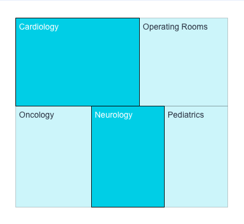

# Class TreemapChartComponent

A component displaying hierarchical data in the form of nested rectangles.
This type of chart can be used instead of a column chart for comparing a large number of categories and sub-categories.

## Example

```html
   <csdk-treemap-chart
     [dataSet]="chart.dataSet"
     [dataOptions]="chart.dataOptions"
     [highlights]="filters"
     [beforeRender]="onBeforeRender"
     (dataPointClick)="logArguments($event)"
     (dataPointContextMenu)="logArguments($event)"
     (dataPointsSelect)="logArguments($event)"
   />
```
```ts
import { Component } from '@angular/core';
import { measureFactory, filterFactory } from '@sisense/sdk-data';
import type { ChartType } from '@sisense/sdk-ui-angular';
import * as DM from '../../assets/sample-healthcare-model';

@Component({
 selector: 'app-analytics',
 templateUrl: './analytics.component.html',
 styleUrls: ['./analytics.component.scss'],
})
export class AnalyticsComponent {
 DM = DM;
 filters = [filterFactory.members(DM.Divisions.Divison_name, ['Cardiology', 'Neurology'])];
 chart = {
   chartType: 'column' as ChartType,
   dataSet: DM.DataSource,
   dataOptions: {
     category: [DM.Divisions.Divison_name],
     value: [measureFactory.sum(DM.Admissions.Cost_of_admission)],
     breakBy: [],
   },
 };

 onBeforeRender(options: any) {
   console.log('beforeRender');
   console.log(options);
   return options;
 }

 logArguments(...args: any[]) {
   console.log(args);
 }
}
```


## Constructors

### constructor

> **new TreemapChartComponent**(): [`TreemapChartComponent`](class.TreemapChartComponent.md)

#### Returns

[`TreemapChartComponent`](class.TreemapChartComponent.md)

## Properties

### Data

#### dataSet

> **dataSet**: [`Data`](../../sdk-data/interfaces/interface.Data.md) \| [`DataSource`](../../sdk-data/type-aliases/type-alias.DataSource.md) \| `undefined`

Data set for a chart using one of the following options. If neither option is specified, the chart
will use the `defaultDataSource` specified in the parent `SisenseContextProvider`
component.

(1) Sisense data source name as a string. For example, `'Sample ECommerce'`. Typically, you
retrieve the data source name from a data model you create using the `get-data-model`
[command](https://developer.sisense.com/guides/sdk/guides/cli.html) of the Compose SDK CLI. The chart
connects to the data source, executes a query, and loads the data as specified in
`dataOptions`, `filters`, and `highlights`.

To learn more about using data from a Sisense data source, see the
[Compose SDK Charts Guide](/guides/sdk/guides/charts/guide-compose-sdk-charts.html#sisense-data).

OR

(2) Explicit [`Data`](../../sdk-data/interfaces/interface.Data.md), which is made up of an array of
[`Column`](../../sdk-data/interfaces/interface.Column.md) objects and a two-dimensional array of row data. This approach
allows the chart component to be used with any data you provide.

To learn more about using data from an external data source, see the
[Compose SDK Charts Guide](/guides/sdk/guides/charts/guide-compose-sdk-charts.html#explicit-data).

Example data in the proper format:

```ts
const sampleData = {
  columns: [
    { name: 'Years', type: 'date' },
    { name: 'Quantity', type: 'number' },
    { name: 'Units', type: 'number' },
  ],
  rows: [
    ['2019', 5500, 1500],
    ['2020', 4471, 7000],
    ['2021', 1812, 5000],
    ['2022', 5001, 6000],
    ['2023', 2045, 4000],
  ],
};
```

***

#### filters

> **filters**: [`FilterRelations`](../../sdk-data/interfaces/interface.FilterRelations.md) \| [`Filter`](../../sdk-data/interfaces/interface.Filter.md)[] \| `undefined`

Filters to limit (or slice) a chart’s data using one of the following options.

(1) Array of [Filter](../../sdk-data/interfaces/interface.Filter.md) or [FilterRelations](../../sdk-data/interfaces/interface.FilterRelations.md) returned from filter factory functions, such as
[`greaterThan()`](../../sdk-data/factories/namespace.filterFactory/functions/function.greaterThan.md) and [`members()`](../../sdk-data/factories/namespace.filterFactory/functions/function.members.md).

Use this option for filters that do not require a UI to set them
or for filters where you will supply your own UI components or use pre-built UI components. This is the most common option.

To learn more about using filter factory functions to create filters, see the [Compose SDK Charts Guide](/guides/sdk/guides/charts/guide-compose-sdk-charts.html#filter-functions).

(2) Array of [Filter](../../sdk-data/interfaces/interface.Filter.md) controlled by filter UI components – for example [`MemberFilterTile`](../../sdk-ui/filter-tiles/function.MemberFilterTile.md).

Use this option for filters that you want your users to set using pre-built UI components.

To learn more about using filter UI components to create filters, see the [Compose SDK Charts Guide](/guides/sdk/guides/charts/guide-compose-sdk-charts.html#filter-components).

***

#### highlights

> **highlights**: [`Filter`](../../sdk-data/interfaces/interface.Filter.md)[] \| `undefined`

Highlights based on filter criteria to apply to a chart using one of the following options.

NOTE that the filter dimensions used in highlights must match those defined in the
`dataOptions` of the chart. Otherwise, the filters will be applied as regular slice filters.

(1) Array of [Filter](../../sdk-data/interfaces/interface.Filter.md) returned from filter factory functions, such as
[`greaterThan()`](../../sdk-data/factories/namespace.filterFactory/functions/function.greaterThan.md) and [`members()`](../../sdk-data/factories/namespace.filterFactory/functions/function.members.md).

Use this option for highlights that do not require a UI to set them
or for highlights where you will supply your own UI components or use pre-built UI components. This is the most common option.

To learn more about using filter factory functions to create highlights, see the
[Compose SDK Charts Guide](/guides/sdk/guides/charts/guide-compose-sdk-charts.html#filter-functions-for-highlighting).

(2) Array of [Filter](../../sdk-data/interfaces/interface.Filter.md) controlled by filter UI components – for example [`MemberFilterTile`](../../sdk-ui/filter-tiles/function.MemberFilterTile.md).

Use this option for highlights that you want your users to set using pre-built UI components.

To learn more about using filter components to create highlights, see the
[Compose SDK Charts Guide](/guides/sdk/guides/charts/guide-compose-sdk-charts.html#filter-components-for-highlighting).

### Chart

#### dataOptions

> **dataOptions**: [`CategoricalChartDataOptions`](../interfaces/interface.CategoricalChartDataOptions.md)

Configurations for how to interpret and present the data passed to the chart

***

#### styleOptions

> **styleOptions**: [`TreemapStyleOptions`](../interfaces/interface.TreemapStyleOptions.md) \| `undefined`

Configurations for how to style and present a chart's data.

### Callbacks

#### beforeRender

> **beforeRender**: [`BeforeRenderHandler`](../type-aliases/type-alias.BeforeRenderHandler.md) \| `undefined`

A callback that allows you to customize the underlying chart element before it is rendered.
Use the `highchartsOptions` object that is passed to the callback to change
[options values](https://api.highcharts.com/highcharts/) and then return the modified options
object. The returned options are then used when rendering the chart.

This callback is not supported for Indicator Chart, Areamap Chart, Scattermap Chart, and Table.

For an example of how the `onBeforeRender` callback can be used, see the
[Compose SDK Charts Guide](/guides/sdk/guides/charts/guide-compose-sdk-charts.html#callbacks).

***

#### dataPointClick

> **dataPointClick**: `EventEmitter`\< [`DataPointEvent`](../type-aliases/type-alias.DataPointEvent.md) \>

A callback that allows you to customize what happens when a data point is clicked.

To learn more about callbacks, see the [Compose SDK Charts Guide](/guides/sdk/guides/charts/guide-compose-sdk-charts.html#callbacks).

***

#### dataPointContextMenu

> **dataPointContextMenu**: `EventEmitter`\< [`DataPointEvent`](../type-aliases/type-alias.DataPointEvent.md) \>

A callback that allows you to customize what happens when a context menu is displayed for a data point.

To learn more about callbacks, see the [Compose SDK Charts Guide](/guides/sdk/guides/charts/guide-compose-sdk-charts.html#callbacks).

***

#### dataPointsSelect

> **dataPointsSelect**: `EventEmitter`\< [`DataPointsEvent`](../type-aliases/type-alias.DataPointsEvent.md) \>

A callback that allows you to customize what happens when data points are selected.

To learn more about callbacks, see the [Compose SDK Charts Guide](/guides/sdk/guides/charts/guide-compose-sdk-charts.html#callbacks).

***

#### dataReady

> **dataReady**: (`data`) => [`Data`](../../sdk-data/interfaces/interface.Data.md) \| `undefined`

A callback that allows to modify data immediately after it has been retrieved.
Can be used to inject modification of queried data.
