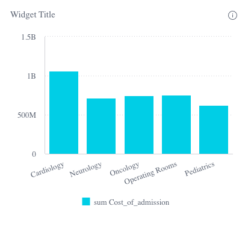

# Class ChartWidgetComponent

The Chart Widget component extending [ChartComponent](../charts/class.ChartComponent.md) to support widget style options.

## Example

```html
<csdk-chart-widget
  [chartType]="chartWidget.chartType"
  [dataSource]="chartWidget.dataSource"
  [dataOptions]="chartWidget.dataOptions"
  [highlights]="filters"
  [title]="chartWidget.title"
  [description]="chartWidget.description"
  [beforeRender]="onBeforeRender"
  (dataPointClick)="logArguments($event)"
  (dataPointContextMenu)="logArguments($event)"
  (dataPointsSelect)="logArguments($event)"
/>
```
```ts
import { Component } from '@angular/core';
import { ChartType } from '@sisense/sdk-ui-angular';
import { filterFactory } from '@sisense/sdk-data';
import * as DM from '../../assets/sample-healthcare-model';

@Component({
  selector: 'app-widgets',
  templateUrl: './widgets.component.html',
  styleUrls: ['./widgets.component.scss'],
})
export class WidgetsComponent {
  filters = [filterFactory.members(DM.Divisions.Divison_name, ['Cardiology', 'Neurology'])];
  chartWidget = {
    chartType: 'column' as ChartType,
    dataSource: DM.DataSource,
    dataOptions: {
      category: [DM.Divisions.Divison_name],
      value: [measureFactory.sum(DM.Admissions.Cost_of_admission)],
      breakBy: [],
    },
    title: 'Chart Title',
    description: 'Chart Description',
  };
 logArguments(...args: any[]) {
  console.log(args);
}

onBeforeRender(options: any) {
  console.log('beforeRender');
  console.log(options);
  return options;
}

}
```


## Implements

- `AfterViewInit`
- `OnChanges`
- `OnDestroy`

## Constructors

### constructor

> **new ChartWidgetComponent**(`sisenseContextService`, `themeService`): [`ChartWidgetComponent`](class.ChartWidgetComponent.md)

#### Parameters

| Parameter | Type |
| :------ | :------ |
| `sisenseContextService` | [`SisenseContextService`](../contexts/class.SisenseContextService.md) |
| `themeService` | [`ThemeService`](../contexts/class.ThemeService.md) |

#### Returns

[`ChartWidgetComponent`](class.ChartWidgetComponent.md)

## Properties

### Data

#### dataSource

> **dataSource**: [`DataSource`](../../sdk-data/type-aliases/type-alias.DataSource.md) \| `undefined`

Data source the query is run against - e.g. `Sample ECommerce`

If not specified, the query will use the `defaultDataSource` specified in the parent Sisense Context.

***

#### filters

> **filters**: [`FilterRelations`](../../sdk-data/interfaces/interface.FilterRelations.md) \| [`Filter`](../../sdk-data/interfaces/interface.Filter.md)[] \| `undefined`

Filters that will slice query results

***

#### highlights

> **highlights**: [`Filter`](../../sdk-data/interfaces/interface.Filter.md)[] \| `undefined`

Highlight filters that will highlight results that pass filter criteria

### Chart

#### chartType

> **chartType**: [`ChartType`](../type-aliases/type-alias.ChartType.md)

Default chart type of each series

***

#### dataOptions

> **dataOptions**: [`ChartDataOptions`](../type-aliases/type-alias.ChartDataOptions.md)

Configurations for how to interpret and present the data passed to the chart

### Widget

#### description

> **description**: `string` \| `undefined`

Description of the widget

***

#### highlightSelectionDisabled

> **highlightSelectionDisabled**: `boolean` \| `undefined`

Boolean flag whether selecting data points triggers highlight filter of the selected data

Recommended to turn on when the Chart Widget component is enhanced with data drilldown by the Drilldown Widget component

If not specified, the default value is `false`

***

#### styleOptions

> **styleOptions**: [`ChartWidgetStyleOptions`](../type-aliases/type-alias.ChartWidgetStyleOptions.md) \| `undefined`

Style options for both the chart and widget including the widget header

***

#### title

> **title**: `string` \| `undefined`

Title of the widget

### Callbacks

#### beforeRender

> **beforeRender**: [`BeforeRenderHandler`](../type-aliases/type-alias.BeforeRenderHandler.md) \| [`IndicatorBeforeRenderHandler`](../type-aliases/type-alias.IndicatorBeforeRenderHandler.md) \| `undefined`

A callback that allows you to customize the underlying chart element before it is rendered. The returned options are then used when rendering the chart.

This callback is not supported for Areamap Chart, Scattermap Chart, Table, and PivotTable.

***

#### dataPointClick

> **dataPointClick**: `EventEmitter`\< [`ChartDataPointEvent`](../type-aliases/type-alias.ChartDataPointEvent.md) \>

Click handler callback for a data point

***

#### dataPointContextMenu

> **dataPointContextMenu**: `EventEmitter`\< [`ChartDataPointEvent`](../type-aliases/type-alias.ChartDataPointEvent.md) \>

Context menu handler callback for a data point

***

#### dataPointsSelect

> **dataPointsSelect**: `EventEmitter`\< [`ChartDataPointsEvent`](../type-aliases/type-alias.ChartDataPointsEvent.md) \>

Handler callback for selection of multiple data points
