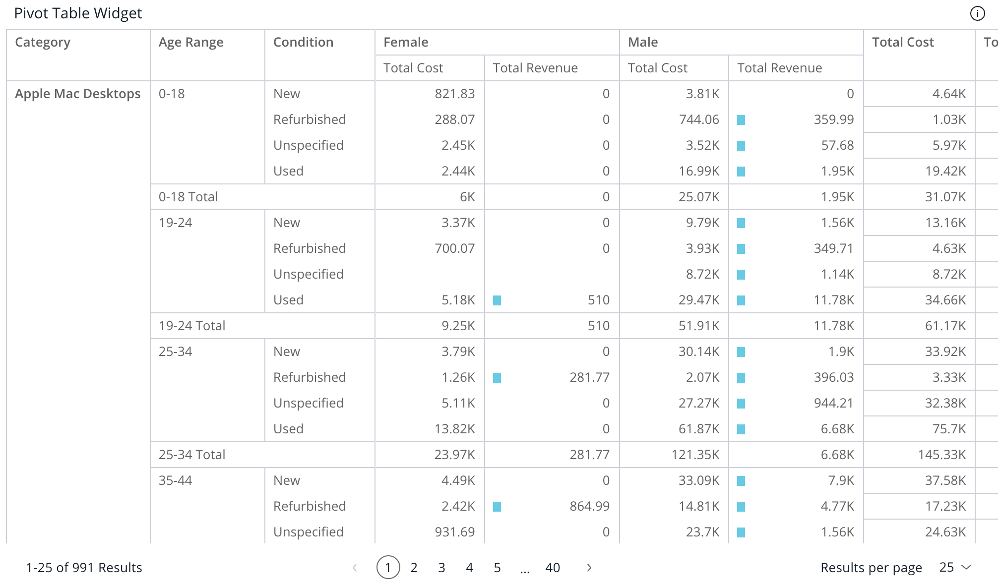

# Class PivotTableWidgetComponent <Badge type="beta" text="Beta" />

The Pivot Table Widget component extends the [PivotTableComponent](../data-grids/class.PivotTableComponent.md) component to support widget features,
including a header, widget style options, and more.

## Example

```html
<csdk-pivot-table-widget
 [dataSource]="pivotProps.dataSource"
 [dataOptions]="pivotProps.dataOptions"
 [filters]="pivotProps.filters"
 [styleOptions]="pivotProps.styleOptions"
 [title]="pivotProps.title"
 [description]="pivotProps.description"
/>
```
```ts
import { Component } from '@angular/core';
import { type PivotTableWidgetProps } from '@ethings-os/sdk-ui-angular';
import { measureFactory, filterFactory } from '@ethings-os/sdk-data';
import * as DM from '../../assets/sample-ecommerce';

@Component({
 selector: 'app-analytics',
 templateUrl: './analytics.component.html',
 styleUrls: ['./analytics.component.scss'],
})
export class AnalyticsComponent {

 pivotProps: PivotTableWidgetProps = {
   dataSource: DM.DataSource,
   dataOptions: {
     rows: [
       { column: DM.Category.Category, includeSubTotals: true },
       { column: DM.Commerce.AgeRange, includeSubTotals: true },
       DM.Commerce.Condition,
     ],
     columns: [{ column: DM.Commerce.Gender, includeSubTotals: true }],
     values: [
       measureFactory.sum(DM.Commerce.Cost, 'Total Cost'),
       {
         column: measureFactory.sum(DM.Commerce.Revenue, 'Total Revenue'),
         totalsCalculation: 'sum',
         dataBars: true,
       },
     ],
     grandTotals: { title: 'Grand Total', rows: true, columns: true },
   },
   filters: [filterFactory.members(DM.Commerce.Gender, ['Female', 'Male'])],
   styleOptions: { width: 1400, height: 600, rowsPerPage: 25 },
   title: 'Pivot Table Widget',
   description: 'Pivot Table Widget Description',
 };
}
```


## Implements

- `AfterViewInit`
- `OnChanges`
- `OnDestroy`

## Constructors

### constructor

> **new PivotTableWidgetComponent**(`sisenseContextService`, `themeService`): [`PivotTableWidgetComponent`](class.PivotTableWidgetComponent.md)

#### Parameters

| Parameter | Type |
| :------ | :------ |
| `sisenseContextService` | [`SisenseContextService`](../contexts/class.SisenseContextService.md) |
| `themeService` | [`ThemeService`](../contexts/class.ThemeService.md) |

#### Returns

[`PivotTableWidgetComponent`](class.PivotTableWidgetComponent.md)

## Properties

### Data

#### dataOptions

> **dataOptions**: [`PivotTableDataOptions`](../interfaces/interface.PivotTableDataOptions.md)

Configurations for how to interpret and present the data passed to the table

***

#### dataSource

> **dataSource**: [`DataSource`](../../sdk-data/type-aliases/type-alias.DataSource.md) \| `undefined`

Data source the query is run against - e.g. `Sample ECommerce`

If not specified, the query will use the `defaultDataSource` specified in the parent Sisense Context.

***

#### filters

> **filters**: [`FilterRelations`](../../sdk-data/interfaces/interface.FilterRelations.md) \| [`Filter`](../../sdk-data/interfaces/interface.Filter.md)[] \| `undefined`

Filters that will slice query results

***

#### highlights

> **highlights**: [`Filter`](../../sdk-data/interfaces/interface.Filter.md)[] \| `undefined`

Filters that will highlight query results

### Widget

#### description

> **description**: `string` \| `undefined`

Title of the widget

***

#### title

> **title**: `string` \| `undefined`

Title of the widget

### Representation

#### styleOptions

> **styleOptions**: [`PivotTableWidgetStyleOptions`](../type-aliases/type-alias.PivotTableWidgetStyleOptions.md) \| `undefined`

Style options for both the table and widget including the widget header
