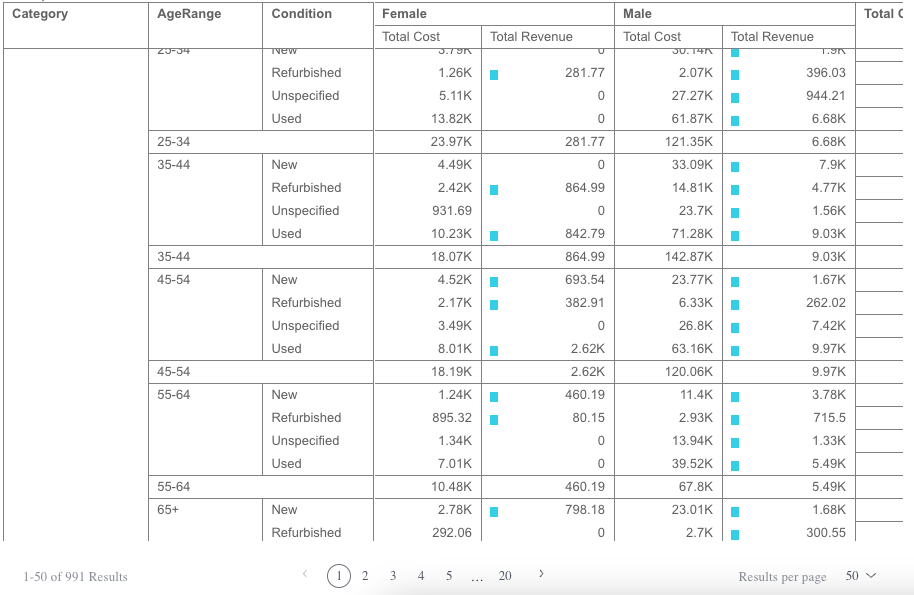

# Class PivotTableComponent

Pivot Table with and pagination.

## Example

```html
 <csdk-pivot-table
   [dataSet]="pivotTable.dataSet"
   [dataOptions]="pivotTable.dataOptions"
   [filters]="pivotTable.filters"
   [styleOptions]="pivotTable.styleOptions"
 />
```
```ts
import { Component } from '@angular/core';
import { measureFactory, filterFactory } from '@sisense/sdk-data';
import * as DM from '../../assets/sample-ecommerce';
import type { PivotTableDataOptions } from '@sisense/sdk-ui-angular';

@Component({
 selector: 'app-analytics',
 templateUrl: './analytics.component.html',
 styleUrls: ['./analytics.component.scss'],
})
export class AnalyticsComponent {

 pivotTableDataOptions: PivotTableDataOptions = {
   rows: [
     { column: DM.Category.Category, includeSubTotals: true },
     { column: DM.Commerce.AgeRange, includeSubTotals: true },
     DM.Commerce.Condition,
   ],
   columns: [{ column: DM.Commerce.Gender, includeSubTotals: true }],
   values: [
     measureFactory.sum(DM.Commerce.Cost, 'Total Cost'),
     {
       column: measureFactory.sum(DM.Commerce.Revenue, 'Total Revenue'),
       totalsCalculation: 'sum',
       dataBars: true,
     },
   ],
   grandTotals: { rows: true, columns: true },
 };

 pivotTable = {
   dataSet: DM.DataSource,
   dataOptions: this.pivotTableDataOptions,
   filters: [filterFactory.members(DM.Commerce.Gender, ['Female', 'Male'])],
   styleOptions: { width: 1400, height: 600, rowsPerPage: 50 },
 };

}
```


## Remarks

Configuration options can also be applied within the scope of a `<SisenseContextProvider>` to control the default behavior of PivotTable, by changing available settings within `appConfig.chartConfig.tabular.*`

Follow the link to [AppConfig](../type-aliases/type-alias.AppConfig.md) for more details on the available settings.

## Implements

- `AfterViewInit`
- `OnChanges`
- `OnDestroy`

## Constructors

### constructor

> **new PivotTableComponent**(`sisenseContextService`, `themeService`): [`PivotTableComponent`](class.PivotTableComponent.md)

#### Parameters

| Parameter | Type |
| :------ | :------ |
| `sisenseContextService` | [`SisenseContextService`](../contexts/class.SisenseContextService.md) |
| `themeService` | [`ThemeService`](../contexts/class.ThemeService.md) |

#### Returns

[`PivotTableComponent`](class.PivotTableComponent.md)

## Properties

### Data

#### dataOptions

> **dataOptions**: [`PivotTableDataOptions`](../interfaces/interface.PivotTableDataOptions.md)

Configurations for how to interpret and present the data passed to the component

***

#### dataSet

> **dataSet**: [`DataSource`](../../sdk-data/type-aliases/type-alias.DataSource.md) \| `undefined`

Data source name (as a `string`) - e.g. `Sample ECommerce`.

If not specified, the component will use the `defaultDataSource` specified in the parent Sisense Context.

***

#### filters

> **filters**: [`FilterRelations`](../../sdk-data/interfaces/interface.FilterRelations.md) \| [`Filter`](../../sdk-data/interfaces/interface.Filter.md)[] \| `undefined`

Filters that will slice query results

***

#### highlights

> **highlights**: [`Filter`](../../sdk-data/interfaces/interface.Filter.md)[] \| `undefined`

Filters that will highlight query results

### Representation

#### styleOptions

> **styleOptions**: [`PivotTableStyleOptions`](../interfaces/interface.PivotTableStyleOptions.md) \| `undefined`

Configurations for how to style and present a pivot table's data.
