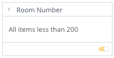

# Class CriteriaFilterTileComponent

Criteria Filter Tile Component

## Example

```html
    <csdk-criteria-filter-tile
      [title]="criteriaFilterTileProps.title"
      [filter]="criteriaFilterTileProps.filter"
      (filterChange)="criteriaFilterTileProps.setFilter($event)"
    />
```
```ts
import { Component } from '@angular/core';
import { Filter, filterFactory } from '@ethings-os/sdk-data';
import * as DM from '../../assets/sample-healthcare-model';

@Component({
  selector: 'app-filters',
  templateUrl: './filters.component.html',
  styleUrls: ['./filters.component.scss'],
})
export class FiltersComponent {
  DM = DM;
  title: 'Room Number',
  filter: filterFactory.lessThan(DM.Rooms.Room_number, 200) ,
  setFilter({ filter }: { filter: Filter | null }) {
    console.log(filter);
    if (filter) {
      this.filter = filter ;
    }
  },
}
```


## Implements

- `AfterViewInit`
- `OnChanges`
- `OnDestroy`

## Constructors

### constructor

> **new CriteriaFilterTileComponent**(`sisenseContextService`, `themeService`): [`CriteriaFilterTileComponent`](class.CriteriaFilterTileComponent.md)

Constructor for the `CriteriaFilterTileComponent`.

#### Parameters

| Parameter | Type | Description |
| :------ | :------ | :------ |
| `sisenseContextService` | [`SisenseContextService`](../contexts/class.SisenseContextService.md) | Sisense context service |
| `themeService` | [`ThemeService`](../contexts/class.ThemeService.md) | Theme service |

#### Returns

[`CriteriaFilterTileComponent`](class.CriteriaFilterTileComponent.md)

## Properties

### Constructor

#### sisenseContextService

> **sisenseContextService**: [`SisenseContextService`](../contexts/class.SisenseContextService.md)

Sisense context service

***

#### themeService

> **themeService**: [`ThemeService`](../contexts/class.ThemeService.md)

Theme service

### Other

#### arrangement

> **arrangement**: [`FilterVariant`](../type-aliases/type-alias.FilterVariant.md) \| `undefined`

Arrangement of the filter inputs. Use vertical for standard filter tiles and horizontal for toolbars

***

#### filter

> **filter**: [`Filter`](../../sdk-data/interfaces/interface.Filter.md)

Text or numeric filter object to initialize filter type and default values

***

#### filterChange

> **filterChange**: `EventEmitter`\< `ArgumentsAsObject`\< (`filter`) => `void`, [`"filter"`] \> \>

Callback returning updated filter object

***

#### measures

> **measures**: [`Measure`](../../sdk-data/interfaces/interface.Measure.md)[] \| `undefined`

List of available measures to rank by. Required only for ranking filters.

***

#### title

> **title**: `string`

Title for the filter tile, which is rendered into the header
