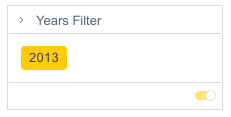

# Class FilterTileComponent

UI component that renders a filter tile based on filter type

## Example

Here’s how to render a filter model as a filter tile.

```html
<!--Component HTML template in example.component.html-->
<csdk-filter-tile
 [filter]="filterTileProps.filter"
 (filterChange)="filterTileProps.filterChange($event)"
/>
```

```ts
// Component behavior in example.component.ts
import { Component } from '@angular/core';
import { type FilterTileProps } from '@sisense/sdk-ui-angular';
import { filterFactory } from '@sisense/sdk-data';
import * as DM from '../../assets/sample-healthcare-model';

@Component({
 selector: 'example',
 templateUrl: './example.component.html',
 styleUrls: ['./example.component.scss'],
})
export class ExampleComponent {
 filterTileProps: FilterTileProps = {
   filter: filterFactory.members(DM.ER.Date.Years, ['2013-01-01T00:00:00']),
   filterChange({ filter }) {
     if (filter) {
       this.filter = filter;
     }
   },
 };
}
```


## Implements

- `AfterViewInit`
- `OnChanges`
- `OnDestroy`

## Constructors

### constructor

> **new FilterTileComponent**(`sisenseContextService`, `themeService`): [`FilterTileComponent`](class.FilterTileComponent.md)

Constructor for the `FilterTileComponent`.

#### Parameters

| Parameter | Type | Description |
| :------ | :------ | :------ |
| `sisenseContextService` | [`SisenseContextService`](../contexts/class.SisenseContextService.md) | Sisense context service |
| `themeService` | [`ThemeService`](../contexts/class.ThemeService.md) | Theme service |

#### Returns

[`FilterTileComponent`](class.FilterTileComponent.md)

## Properties

### Constructor

#### sisenseContextService

> **sisenseContextService**: [`SisenseContextService`](../contexts/class.SisenseContextService.md)

Sisense context service

***

#### themeService

> **themeService**: [`ThemeService`](../contexts/class.ThemeService.md)

Theme service

### Other

#### defaultDataSource

> **defaultDataSource**: [`DataSource`](../../sdk-data/type-aliases/type-alias.DataSource.md) \| `undefined`

Default data source used for filter tiles

***

#### filter

> **filter**: [`Filter`](../../sdk-data/interfaces/interface.Filter.md)

Filter to display

***

#### filterChange

> **filterChange**: `EventEmitter`\< [`FilterChangeEvent`](../type-aliases/type-alias.FilterChangeEvent.md) \>

Filter change event handler.

***

#### filterDelete

> **filterDelete**: `EventEmitter`\< `void` \>

Filter delete event handler.

***

#### filterEdit

> **filterEdit**: `EventEmitter`\< [`FilterEditEvent`](../type-aliases/type-alias.FilterEditEvent.md) \>

Filter edit event handler.
