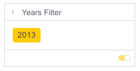

# Class MemberFilterTileComponent

Member Filter Tile Component

## Example

```html
    <csdk-member-filter-tile
      title="Years Filter"
      [attribute]="DM.ER.Date.Years"
      [filter]="memberFilterTileProps.yearFilter"
      (filterChange)="memberFilterTileProps.setYearFilter($event)"
    />
```
```ts
import { Component } from '@angular/core';
import { Filter, filterFactory } from '@ethings-os/sdk-data';
import * as DM from '../../assets/sample-healthcare-model';

@Component({
  selector: 'app-filters',
  templateUrl: './filters.component.html',
  styleUrls: ['./filters.component.scss'],
})
export class FiltersComponent {
  DM = DM;
  memberFilterTileProps = {
    yearFilter: filterFactory.members(DM.ER.Date.Years, ['2013-01-01T00:00:00']),
    setYearFilter({ filter }: { filter: Filter | null }) {
      if (filter) {
        this.yearFilter = filter;
      }
    },
  };
}
```


## Implements

- `AfterViewInit`
- `OnChanges`
- `OnDestroy`

## Constructors

### constructor

> **new MemberFilterTileComponent**(`sisenseContextService`, `themeService`): [`MemberFilterTileComponent`](class.MemberFilterTileComponent.md)

Constructor for the `MemberFilterTileComponent`.

#### Parameters

| Parameter | Type | Description |
| :------ | :------ | :------ |
| `sisenseContextService` | [`SisenseContextService`](../contexts/class.SisenseContextService.md) | Sisense context service |
| `themeService` | [`ThemeService`](../contexts/class.ThemeService.md) | Theme service |

#### Returns

[`MemberFilterTileComponent`](class.MemberFilterTileComponent.md)

## Properties

### Constructor

#### sisenseContextService

> **sisenseContextService**: [`SisenseContextService`](../contexts/class.SisenseContextService.md)

Sisense context service

***

#### themeService

> **themeService**: [`ThemeService`](../contexts/class.ThemeService.md)

Theme service

### Other

#### attribute

> **attribute**: [`Attribute`](../../sdk-data/interfaces/interface.Attribute.md)

Attribute to filter on. A query will run to fetch all this attribute's members

***

#### dataSource

> **dataSource**: [`DataSource`](../../sdk-data/type-aliases/type-alias.DataSource.md) \| `undefined`

Data source the query is run against - e.g. `Sample ECommerce`

If not specified, the query will use the `defaultDataSource` specified in the parent Sisense Context.

***

#### filter

> **filter**: [`Filter`](../../sdk-data/interfaces/interface.Filter.md) \| `null`

Source filter object. Caller is responsible for keeping track of filter state

***

#### filterChange

> **filterChange**: `EventEmitter`\< `ArgumentsAsObject`\< (`filter`) => `void`, [`"filter"`] \> \>

Callback indicating when the source members filter should be updated

***

#### title

> **title**: `string`

Title for the filter tile, which is rendered into the header
