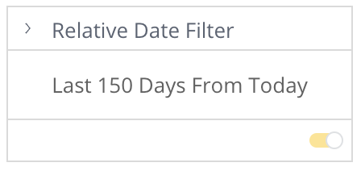

# Class RelativeDateFilterTileComponent

Relative Date Filter Tile Component

## Example

```html
<csdk-relative-date-filter-tile
      [title]="relativeDateFilterTileProps.title"
      [arrangement]="relativeDateFilterTileProps.arrangement"
      [filter]="relativeDateFilterTileProps.filter"
      (filterChange)="relativeDateFilterTileProps.setFilter($event)"
    />
```
```ts
import { Component } from '@angular/core';
import { Filter, filterFactory } from '@ethings-os/sdk-data';
import * as DM from '../../assets/sample-healthcare-model';

@Component({
  selector: 'app-filters',
  templateUrl: './filters.component.html',
  styleUrls: ['./filters.component.scss'],
})
export class FiltersComponent {
  DM = DM;

  relativeDateFilterTileProps = {
    title: 'Relative Date Filter',
    arrangement: 'vertical',
    filter: filterFactory.dateRelativeTo(DM.ER.Date.Days, 0, 150),
    setFilter({ filter }: { filter: Filter | null }) {
      console.log(filter);
      if (filter) {
        this.filter = filter;
      }
    },
  };
}
```


## Implements

- `AfterViewInit`
- `OnChanges`
- `OnDestroy`

## Constructors

### constructor

> **new RelativeDateFilterTileComponent**(`sisenseContextService`, `themeService`): [`RelativeDateFilterTileComponent`](class.RelativeDateFilterTileComponent.md)

Constructor for the `RelativeDateFilterTileComponent`.

#### Parameters

| Parameter | Type | Description |
| :------ | :------ | :------ |
| `sisenseContextService` | [`SisenseContextService`](../contexts/class.SisenseContextService.md) | Sisense context service |
| `themeService` | [`ThemeService`](../contexts/class.ThemeService.md) | Theme service |

#### Returns

[`RelativeDateFilterTileComponent`](class.RelativeDateFilterTileComponent.md)

## Properties

### Constructor

#### sisenseContextService

> **sisenseContextService**: [`SisenseContextService`](../contexts/class.SisenseContextService.md)

Sisense context service

***

#### themeService

> **themeService**: [`ThemeService`](../contexts/class.ThemeService.md)

Theme service

### Other

#### arrangement

> **arrangement**: [`FilterVariant`](../type-aliases/type-alias.FilterVariant.md) \| `undefined`

Arrangement of the filter inputs. Use vertical for standard filter tiles and horizontal for toolbars

***

#### filter

> **filter**: [`Filter`](../../sdk-data/interfaces/interface.Filter.md)

Relative date filter.

***

#### filterChange

> **filterChange**: `EventEmitter`\< `ArgumentsAsObject`\< (`filter`) => `void`, [`"filter"`] \> \>

Callback function that is called when the relative date filter object should be updated.

***

#### limit

> **limit**: \{
  `maxDate`: `string`;
  `minDate`: `string`;
 } \| `undefined`

Limit of the date range that can be selected.

***

#### title

> **title**: `string`

Filter tile title
