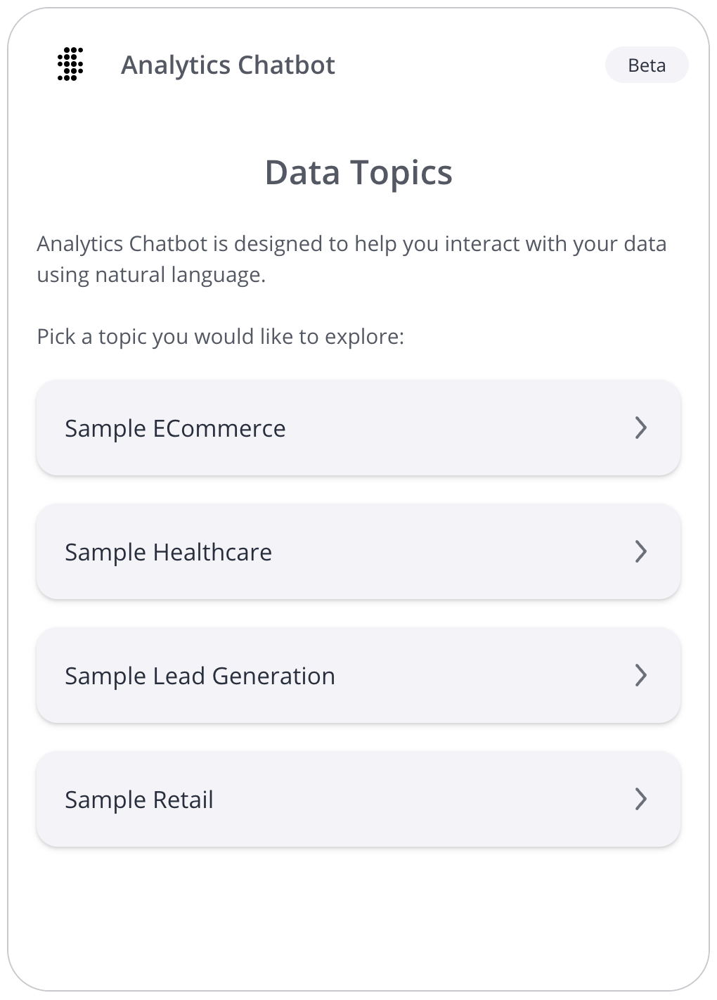

# Class ChatbotComponent <Badge type="beta" text="Beta" />

An Angular component that renders a chatbot with data topic selection.

::: warning Note
This component is currently under beta release for our managed cloud customers on version L2024.2 or above. It is subject to changes as we make fixes and improvements.
:::

## Example

An example of using the `ChatbotComponent`:

```html
<!--Component HTML template in example.component.html-->
<csdk-chatbot
 [width]="chatbot.width"
 [height]="chatbot.height"
 [config]="chatbot.config"
/>
```

```ts
// Component behavior in example.component.ts
import { Component } from '@angular/core';

@Component({
 selector: 'example',
 templateUrl: './example.component.html',
 styleUrls: ['./example.component.scss'],
})
export class ExampleComponent {
 chatbot = {
   width: '500px',
   height: '700px',
   config: {
     numOfRecommendations: 5,
   },
 };
}
```



## Implements

- `AfterViewInit`
- `OnChanges`
- `OnDestroy`

## Constructors

### constructor

> **new ChatbotComponent**(
  `sisenseContextService`,
  `themeService`,
  `aiService`): [`ChatbotComponent`](class.ChatbotComponent.md)

Constructor for the `ChatbotComponent`.

#### Parameters

| Parameter | Type | Description |
| :------ | :------ | :------ |
| `sisenseContextService` | [`SisenseContextService`](../contexts/class.SisenseContextService.md) | Sisense context service |
| `themeService` | [`ThemeService`](../contexts/class.ThemeService.md) | Theme service |
| `aiService` | [`AiService`](class.AiService.md) | AI service |

#### Returns

[`ChatbotComponent`](class.ChatbotComponent.md)

## Properties

### Constructor

#### aiService

> **aiService**: [`AiService`](class.AiService.md)

AI service

***

#### sisenseContextService

> **sisenseContextService**: [`SisenseContextService`](../contexts/class.SisenseContextService.md)

Sisense context service

***

#### themeService

> **themeService**: [`ThemeService`](../contexts/class.ThemeService.md)

Theme service

### Other

#### config

> **config**: `Partial`\< [`ChatConfig`](../interfaces/interface.ChatConfig.md) \> \| `undefined`

Various configuration options for the chatbot

***

#### height

> **height**: `Height`\< `number` \| `string` \> \| `undefined`

Total height of the chatbot

If not specified, a default height of `900px` will be used.

***

#### width

> **width**: `Width`\< `number` \| `string` \> \| `undefined`

Total width of the chatbot

If not specified, a default width of `500px` will be used.
