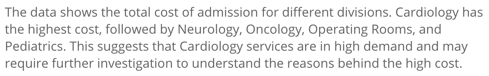

# Class GetNlgInsightsComponent

An Angular component that fetches and displays a collapsible analysis of the provided query using natural language generation (NLG).
Specifying NLG parameters is similar to providing parameters to the [QueryService.executeQuery](../queries/class.QueryService.md#executequery) service method, using dimensions, measures, and filters.

## Example

An example of using the `GetNlgInsightsComponent`:

```html
<!--Component HTML template in example.component.html-->
<csdk-get-nlg-insights
 [dataSource]="nlgParams.dataSource"
 [dimensions]="nlgParams.dimensions"
 [measures]="nlgParams.measures"
/>
```

```ts
// Component behavior in example.component.ts
import { Component } from '@angular/core';
import { measureFactory } from '@ethings-os/sdk-data';
import * as DM from '../../assets/sample-healthcare-model';

@Component({
 selector: 'example',
 templateUrl: './example.component.html',
 styleUrls: ['./example.component.scss'],
})
export class ExampleComponent {
 nlgParams = {
   dataSource: DM.DataSource.title,
   dimensions: [DM.Divisions.Divison_name],
   measures: [measureFactory.sum(DM.Admissions.Cost_of_admission)],
 };
}
```



## Implements

- `AfterViewInit`
- `OnChanges`
- `OnDestroy`

## Constructors

### constructor

> **new GetNlgInsightsComponent**(
  `sisenseContextService`,
  `themeService`,
  `aiService`): [`GetNlgInsightsComponent`](class.GetNlgInsightsComponent.md)

Constructor for the `GetNlgInsightsProps`.

#### Parameters

| Parameter | Type | Description |
| :------ | :------ | :------ |
| `sisenseContextService` | [`SisenseContextService`](../contexts/class.SisenseContextService.md) | Sisense context service |
| `themeService` | [`ThemeService`](../contexts/class.ThemeService.md) | Theme service |
| `aiService` | [`AiService`](class.AiService.md) | AI service |

#### Returns

[`GetNlgInsightsComponent`](class.GetNlgInsightsComponent.md)

## Properties

### Constructor

#### aiService

> **aiService**: [`AiService`](class.AiService.md)

AI service

***

#### sisenseContextService

> **sisenseContextService**: [`SisenseContextService`](../contexts/class.SisenseContextService.md)

Sisense context service

***

#### themeService

> **themeService**: [`ThemeService`](../contexts/class.ThemeService.md)

Theme service

### Other

#### dataSource

> **dataSource**: [`DataSource`](../../sdk-data/type-aliases/type-alias.DataSource.md)

The data source that the query targets - e.g. `Sample ECommerce`

***

#### dimensions

> **dimensions**: [`Attribute`](../../sdk-data/interfaces/interface.Attribute.md)[] \| `undefined`

Dimensions of the query

***

#### filters

> **filters**: [`FilterRelations`](../../sdk-data/interfaces/interface.FilterRelations.md) \| [`Filter`](../../sdk-data/interfaces/interface.Filter.md)[] \| `undefined`

Filters of the query

***

#### measures

> **measures**: [`Measure`](../../sdk-data/interfaces/interface.Measure.md)[] \| `undefined`

Measures of the query

***

#### verbosity

> **verbosity**: `"High"` \| `"Low"` \| `undefined`

The verbosity of the NLG summarization
