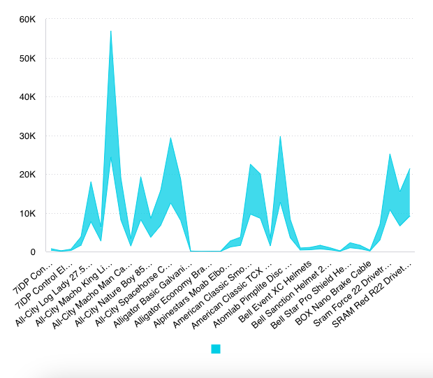

# Class AreaRangeChart <Badge type="beta" text="Beta" />

A Vue component that displays a range of data over a given time period
or across multiple categories. It is particularly useful for visualizing
the minimum and maximum values in a dataset, along with the area between these values.

## Example

Here's how you can use the AreaRangeChart component in a Vue application:
```vue
<template>
<AreaRangeChart
     :dataOptions="areaRangeChartProps.dataOptions"
     :dataSet="areaRangeChartProps.dataSet"
     :filters="areaRangeChartProps.filters"
   />
</template>

<script setup lang="ts">
import { ref } from 'vue';
import { measureFactory } from '@sisense/sdk-data';
import * as DM from '../assets/sample-retail-model';
import {AreaRangeChart, type AreaRangeChartProps} from '@sisense/sdk-ui-vue';

const dimProductName = DM.DimProducts.ProductName;
const areaRangeChartProps = ref<AreaRangeChartProps>({
  dataSet: DM.DataSource,
  dataOptions: {
    category: [dimProductName],
    value: [{
      title: 'Order Revenue',
      upperBound: measureFactory.multiply(
        measureFactory.sum(DM.Fact_Sale_orders.OrderRevenue, 'Lower Revenue'),
        0.6,
      ),
      lowerBound: measureFactory.multiply(
        measureFactory.sum(DM.Fact_Sale_orders.OrderRevenue, 'Upper Revenue'),
        1.4,
      ),
    }],
    breakBy: [],
  },
  filters: [],
});
```


## Param

Area chart properties

## Properties

### dataOptions

> **dataOptions**?: [`RangeChartDataOptions`](../../sdk-ui/interfaces/interface.RangeChartDataOptions.md)

***

### dataSet

> **dataSet**?: [`DataSource`](../../sdk-data/type-aliases/type-alias.DataSource.md) \| [`Data`](../../sdk-data/interfaces/interface.Data.md)

***

### filters

> **filters**?: [`Filter`](../../sdk-data/interfaces/interface.Filter.md)[] \| [`FilterRelations`](../../sdk-data/interfaces/interface.FilterRelations.md)

***

### highlights

> **highlights**?: [`Filter`](../../sdk-data/interfaces/interface.Filter.md)[]

***

### onBeforeRender

> **onBeforeRender**?: [`BeforeRenderHandler`](../type-aliases/type-alias.BeforeRenderHandler.md)

***

### onDataPointClick

> **onDataPointClick**?: [`DataPointEventHandler`](../../sdk-ui/type-aliases/type-alias.DataPointEventHandler.md)

***

### onDataPointContextMenu

> **onDataPointContextMenu**?: [`DataPointEventHandler`](../../sdk-ui/type-aliases/type-alias.DataPointEventHandler.md)

***

### onDataPointsSelected

> **onDataPointsSelected**?: [`DataPointsEventHandler`](../../sdk-ui/type-aliases/type-alias.DataPointsEventHandler.md)

***

### styleOptions

> **styleOptions**?: [`AreaRangeStyleOptions`](../interfaces/interface.AreaRangeStyleOptions.md)
