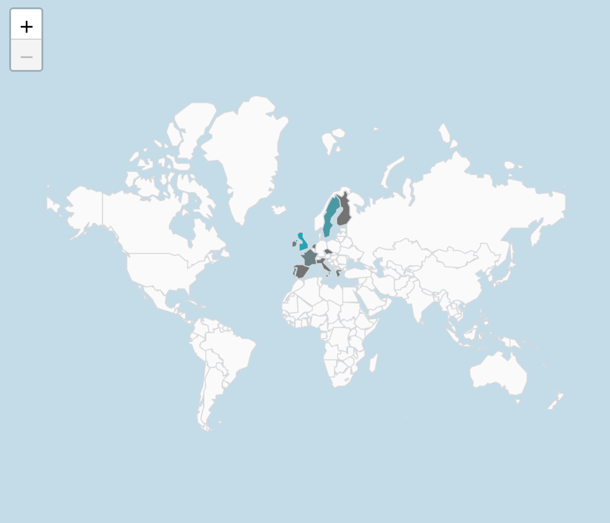

# Class AreamapChart <Badge type="beta" text="Beta" />

A Vue component for visualizing geographical data as polygons on a map.

## Example

Here's how you can use the AreamapChart component in a Vue application:
```vue
<template>
   <AreamapChart
     :dataOptions="areamapChartProps.dataOptions"
     :dataSet="areamapChartProps.dataSet"
     :filters="areamapChartProps.filters"
   />
</template>

<script setup lang="ts">
import { ref } from 'vue';
import { measureFactory, filterFactory } from '@sisense/sdk-data';
import * as DM from '../assets/sample-retail-model';
import {AreamapChart, type AreamapChartProps} from '@sisense/sdk-ui-vue';

const dimProductName = DM.DimProducts.ProductName;
const measureTotalRevenue = measureFactory.sum(DM.Fact_Sale_orders.OrderRevenue, 'Total Revenue');

 const areamapChartProps = ref<AreamapChartProps>({
   dataSet: DM.DataSource,
   dataOptions: {
     geo: [DM.DimCountries.CountryName],
     color: [{ column: measureTotalRevenue, title: 'Total Revenue' }],
   },
   filters: [filterFactory.topRanking(dimProductName, measureTotalRevenue, 10)],
 });
</script>
```


## Param

Areamap chart properties

## Properties

### dataOptions

> **dataOptions**?: [`AreamapChartDataOptions`](../interfaces/interface.AreamapChartDataOptions.md)

***

### dataSet

> **dataSet**?: [`DataSource`](../../sdk-data/type-aliases/type-alias.DataSource.md) \| [`Data`](../../sdk-data/interfaces/interface.Data.md)

***

### filters

> **filters**?: [`Filter`](../../sdk-data/interfaces/interface.Filter.md)[] \| [`FilterRelations`](../../sdk-data/interfaces/interface.FilterRelations.md)

***

### highlights

> **highlights**?: [`Filter`](../../sdk-data/interfaces/interface.Filter.md)[]

***

### onDataPointClick

> **onDataPointClick**?: [`AreamapDataPointEventHandler`](../../sdk-ui/type-aliases/type-alias.AreamapDataPointEventHandler.md)

***

### styleOptions

> **styleOptions**?: [`AreamapStyleOptions`](../interfaces/interface.AreamapStyleOptions.md)
