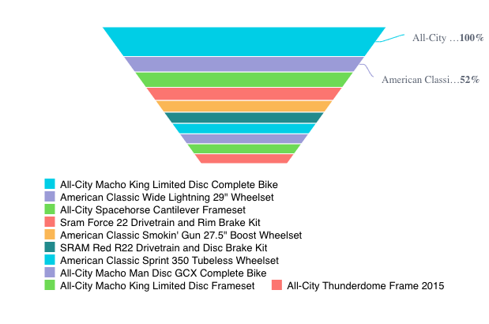

# Class FunnelChart

A Vue component that wraps the FunnelChart Preact component for use in Vue applications.
It maintains compatibility with Vue's reactivity system while preserving the functionality of the FunnelChart.

## Example

Here's how you can use the FunnelChart component in a Vue application:
```vue
<template>
   <FunnelChart
     :dataOptions="funnelChartProps.dataOptions"
     :dataSet="funnelChartProps.dataSet"
     :filters="funnelChartProps.filters"
   />
</template>

<script setup lang="ts">
import { ref } from 'vue';
import {FunnelChart, type FunnelChartProps} from '@sisense/sdk-ui-vue';
import { measureFactory, filterFactory } from '@sisense/sdk-data';
import * as DM from '../assets/sample-retail-model';

const dimProductName = DM.DimProducts.ProductName;
const measureTotalRevenue = measureFactory.sum(DM.Fact_Sale_orders.OrderRevenue, 'Total Revenue');

const funnelChartProps = ref<FunnelChartProps>({
 dataSet: DM.DataSource,
 dataOptions: {
   category: [dimProductName],
   value: [{ column: measureTotalRevenue, sortType: 'sortDesc' }],
 },
 filters: [filterFactory.topRanking(dimProductName, measureTotalRevenue, 10)],
});
</script>
```


Note that the chart sorts the measure, `Unique Users`, in descending order by default.

## Param

Funnel chart properties

## Properties

### dataOptions

> **dataOptions**?: [`CategoricalChartDataOptions`](../interfaces/interface.CategoricalChartDataOptions.md)

***

### dataSet

> **dataSet**?: [`DataSource`](../../sdk-data/type-aliases/type-alias.DataSource.md) \| [`Data`](../../sdk-data/interfaces/interface.Data.md)

***

### filters

> **filters**?: [`Filter`](../../sdk-data/interfaces/interface.Filter.md)[] \| [`FilterRelations`](../../sdk-data/interfaces/interface.FilterRelations.md)

***

### highlights

> **highlights**?: [`Filter`](../../sdk-data/interfaces/interface.Filter.md)[]

***

### onBeforeRender

> **onBeforeRender**?: [`BeforeRenderHandler`](../type-aliases/type-alias.BeforeRenderHandler.md)

***

### onDataPointClick

> **onDataPointClick**?: [`DataPointEventHandler`](../../sdk-ui/type-aliases/type-alias.DataPointEventHandler.md)

***

### onDataPointContextMenu

> **onDataPointContextMenu**?: [`DataPointEventHandler`](../../sdk-ui/type-aliases/type-alias.DataPointEventHandler.md)

***

### onDataPointsSelected

> **onDataPointsSelected**?: [`DataPointsEventHandler`](../../sdk-ui/type-aliases/type-alias.DataPointsEventHandler.md)

***

### styleOptions

> **styleOptions**?: [`FunnelStyleOptions`](../interfaces/interface.FunnelStyleOptions.md)
