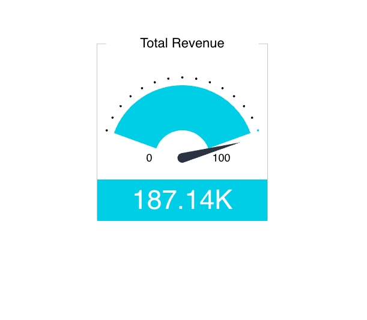

# Class IndicatorChart

A Vue component that provides various options for displaying one or two numeric values as a number, gauge or ticker.
See [Indicator](https://docs.sisense.com/main/SisenseLinux/indicator.htm) for more information.

## Example

Here's how you can use the IndicatorChart component in a Vue application:
```vue
<template>
     <IndicatorChart
       :dataOptions="indicatorChartProps.dataOptions"
       :dataSet="indicatorChartProps.dataSet"
       :filters="indicatorChartProps.filters"
     />
</template>

<script setup lang="ts">
import { ref } from 'vue';
import { measureFactory, filterFactory } from '@sisense/sdk-data';
import * as DM from '../assets/sample-retail-model';
import {IndicatorChart, type IndicatorChartProps} from '@sisense/sdk-ui-vue';

const dimProductName = DM.DimProducts.ProductName;
const measureTotalRevenue = measureFactory.sum(DM.Fact_Sale_orders.OrderRevenue, 'Total Revenue');
  const indicatorChartProps = ref<IndicatorChartProps>({
    dataSet: DM.DataSource,
   dataOptions: {
      value: [{ column: measureTotalRevenue, sortType: 'sortDesc' }],
    },
    filters: [filterFactory.topRanking(dimProductName, measureTotalRevenue, 10)],
  });
</script>
```


## Param

Indicator chart properties

## Properties

### dataOptions

> **dataOptions**?: [`IndicatorChartDataOptions`](../interfaces/interface.IndicatorChartDataOptions.md)

***

### dataSet

> **dataSet**?: [`DataSource`](../../sdk-data/type-aliases/type-alias.DataSource.md) \| [`Data`](../../sdk-data/interfaces/interface.Data.md)

***

### filters

> **filters**?: [`Filter`](../../sdk-data/interfaces/interface.Filter.md)[] \| [`FilterRelations`](../../sdk-data/interfaces/interface.FilterRelations.md)

***

### highlights

> **highlights**?: [`Filter`](../../sdk-data/interfaces/interface.Filter.md)[]

***

### styleOptions

> **styleOptions**?: [`IndicatorStyleOptions`](../type-aliases/type-alias.IndicatorStyleOptions.md)
