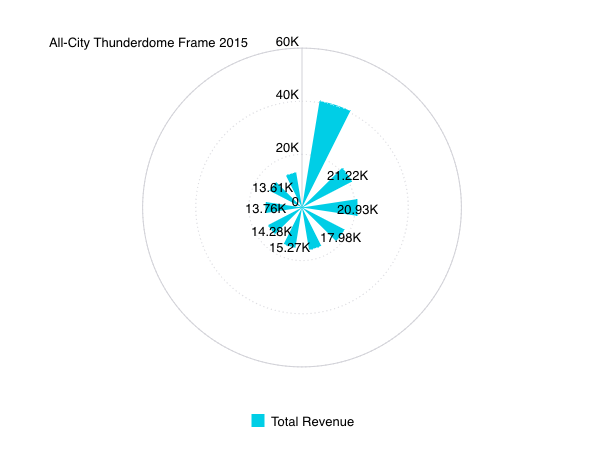

# Class PolarChart

A Vue component comparing multiple categories/variables with a spacial perspective in a radial chart.

## Example

Here's how you can use the PolarChart component in a Vue application:
```vue
<template>
     <PolarChart
       :dataOptions="polarChartProps.dataOptions"
       :dataSet="polarChartProps.dataSet"
       :filters="polarChartProps.filters"
     />
</template>

<script setup lang="ts">
import { ref } from 'vue';
import { measureFactory, filterFactory } from '@sisense/sdk-data';
import * as DM from '../assets/sample-retail-model';
import {PolarChart,type PolarChartProps} from '@sisense/sdk-ui-vue';

const dimProductName = DM.DimProducts.ProductName;
const measureTotalRevenue = measureFactory.sum(DM.Fact_Sale_orders.OrderRevenue, 'Total Revenue');
const polarChartProps = ref<PolarChartProps>({
   dataSet: DM.DataSource,
   dataOptions: {
     category: [dimProductName],
     value: [{ column: measureTotalRevenue, sortType: 'sortDesc' }],
     breakBy: [],
   },
   filters: [filterFactory.topRanking(dimProductName, measureTotalRevenue, 10)],
 });
```


## Param

Polar chart properties

## Properties

### dataOptions

> **dataOptions**?: [`CartesianChartDataOptions`](../interfaces/interface.CartesianChartDataOptions.md)

***

### dataSet

> **dataSet**?: [`DataSource`](../../sdk-data/type-aliases/type-alias.DataSource.md) \| [`Data`](../../sdk-data/interfaces/interface.Data.md)

***

### filters

> **filters**?: [`Filter`](../../sdk-data/interfaces/interface.Filter.md)[] \| [`FilterRelations`](../../sdk-data/interfaces/interface.FilterRelations.md)

***

### highlights

> **highlights**?: [`Filter`](../../sdk-data/interfaces/interface.Filter.md)[]

***

### onBeforeRender

> **onBeforeRender**?: [`BeforeRenderHandler`](../type-aliases/type-alias.BeforeRenderHandler.md)

***

### onDataPointClick

> **onDataPointClick**?: [`DataPointEventHandler`](../../sdk-ui/type-aliases/type-alias.DataPointEventHandler.md)

***

### onDataPointContextMenu

> **onDataPointContextMenu**?: [`DataPointEventHandler`](../../sdk-ui/type-aliases/type-alias.DataPointEventHandler.md)

***

### onDataPointsSelected

> **onDataPointsSelected**?: [`DataPointsEventHandler`](../../sdk-ui/type-aliases/type-alias.DataPointsEventHandler.md)

***

### styleOptions

> **styleOptions**?: [`PolarStyleOptions`](../interfaces/interface.PolarStyleOptions.md)
