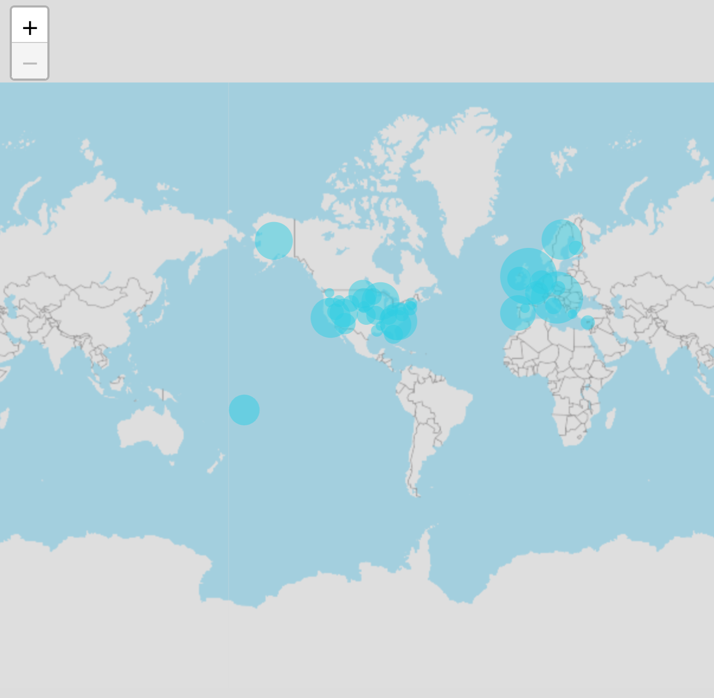

# Class ScattermapChart

A Vue component that wraps the ScattermapChart Preact component for use in Vue applications.
It maintains compatibility with Vue's reactivity system while preserving the functionality of the ScattermapChart.

## Example

Here's how you can use the ScattermapChart component in a Vue application:
```vue
<template>
     <ScattermapChart
       :dataOptions="scattermapChartProps.dataOptions"
       :dataSet="scattermapChartProps.dataSet"
       :filters="scattermapChartProps.filters"
     />
</template>

<script setup lang="ts">
import { ref } from 'vue';
import { measureFactory, filterFactory } from '@sisense/sdk-data';
import * as DM from '../assets/sample-retail-model';
import {ScattermapChart,type ScattermapChartProps} from '@sisense/sdk-ui-vue';

const dimProductName = DM.DimProducts.ProductName;
const measureTotalRevenue = measureFactory.sum(DM.Fact_Sale_orders.OrderRevenue, 'Total Revenue');
const scattermapChartProps = ref<ScattermapChartProps>({
   dataSet: DM.DataSource,
   dataOptions: {
     geo: [DM.DimCountries.CountryName],
     size: { column: measureTotalRevenue, title: 'Total Revenue' },
   },
   filters: [filterFactory.topRanking(dimProductName, measureTotalRevenue, 10)],
 });
</script>
```


## Param

Scattermap chart properties

## Properties

### dataOptions

> **dataOptions**?: [`ScattermapChartDataOptions`](../interfaces/interface.ScattermapChartDataOptions.md)

***

### dataSet

> **dataSet**?: [`DataSource`](../../sdk-data/type-aliases/type-alias.DataSource.md) \| [`Data`](../../sdk-data/interfaces/interface.Data.md)

***

### filters

> **filters**?: [`Filter`](../../sdk-data/interfaces/interface.Filter.md)[] \| [`FilterRelations`](../../sdk-data/interfaces/interface.FilterRelations.md)

***

### highlights

> **highlights**?: [`Filter`](../../sdk-data/interfaces/interface.Filter.md)[]

***

### onDataPointClick

> **onDataPointClick**?: [`ScattermapDataPointEventHandler`](../../sdk-ui/type-aliases/type-alias.ScattermapDataPointEventHandler.md)

***

### styleOptions

> **styleOptions**?: [`ScattermapStyleOptions`](../interfaces/interface.ScattermapStyleOptions.md)
