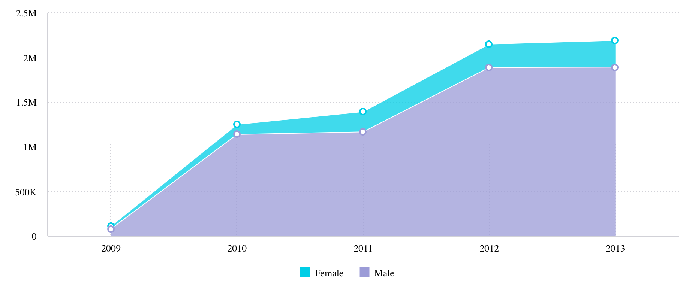

# Class AreaChart

A Vue component similar to a [LineChart](class.LineChart.md),
but with filled in areas under each line and an option to display them as stacked.
More info on [Sisense Documentation page](https://docs.sisense.com/main/SisenseLinux/area-chart.htm).



## Example

Here's how you can use the AreaChart component in a Vue application:
```vue
<template>
<AreaChart
     :dataOptions="areaChartProps.dataOptions"
     :dataSet="areaChartProps.dataSet"
     :filters="areaChartProps.filters"
   />
</template>

<script setup lang="ts">
import { ref } from 'vue';
import {AreaChart, type AreaChartProps} from '@sisense/sdk-ui-vue';

const areaChartProps = ref<AreaChartProps>({
  dataSet: DM.DataSource,
  dataOptions: {
    category: [dimProductName],
    value: [{ column: measureTotalRevenue, sortType: 'sortDesc' }],
    breakBy: [],
  },
  filters: [],
});
```

## Param

Area chart properties

## Properties

### dataOptions

> **dataOptions**?: [`CartesianChartDataOptions`](../interfaces/interface.CartesianChartDataOptions.md)

***

### dataSet

> **dataSet**?: [`DataSource`](../../sdk-data/type-aliases/type-alias.DataSource.md) \| [`Data`](../../sdk-data/interfaces/interface.Data.md)

***

### filters

> **filters**?: [`Filter`](../../sdk-data/interfaces/interface.Filter.md)[] \| [`FilterRelations`](../../sdk-data/interfaces/interface.FilterRelations.md)

***

### highlights

> **highlights**?: [`Filter`](../../sdk-data/interfaces/interface.Filter.md)[]

***

### onBeforeRender

> **onBeforeRender**?: [`BeforeRenderHandler`](../type-aliases/type-alias.BeforeRenderHandler.md)

***

### onDataPointClick

> **onDataPointClick**?: [`DataPointEventHandler`](../../sdk-ui/type-aliases/type-alias.DataPointEventHandler.md)

***

### onDataPointContextMenu

> **onDataPointContextMenu**?: [`DataPointEventHandler`](../../sdk-ui/type-aliases/type-alias.DataPointEventHandler.md)

***

### onDataPointsSelected

> **onDataPointsSelected**?: [`DataPointsEventHandler`](../../sdk-ui/type-aliases/type-alias.DataPointsEventHandler.md)

***

### styleOptions

> **styleOptions**?: [`AreaStyleOptions`](../interfaces/interface.AreaStyleOptions.md)
