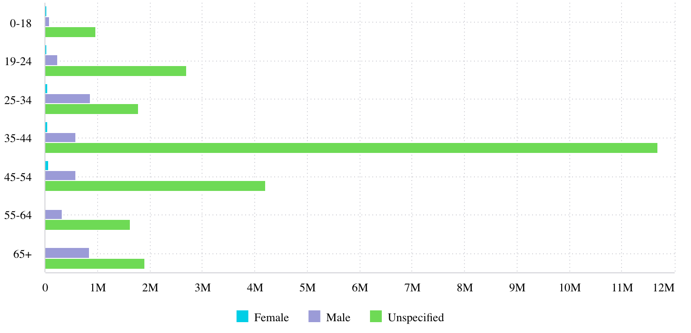

# Class BarChart

A Vue component representing categorical data with horizontal rectangular bars,
whose lengths are proportional to the values that they represent.
See [Bar Chart](https://docs.sisense.com/main/SisenseLinux/bar-chart.htm) for more information.

## Example

Here's how you can use the BarChart component in a Vue application:
```vue
<template>
   <BarChart
     :dataOptions="barChartProps.dataOptions"
     :dataSet="barChartProps.dataSet"
     :filters="barChartProps.filters"
   />
</template>

<script setup lang="ts">
import { ref } from 'vue';
import {BarChart} from '@sisense/sdk-ui-vue';

 const barChartProps = ref<BarChartProps>({
   dataSet: DM.DataSource,
   dataOptions: {
     category: [dimProductName],
     value: [{ column: measureTotalRevenue, sortType: 'sortDesc' }],
     breakBy: [],
   },
   filters: [filterFactory.topRanking(dimProductName, measureTotalRevenue, 10)],
 });
</script>
```


## Param

Bar chart properties

## Properties

### dataOptions

> **dataOptions**?: [`CartesianChartDataOptions`](../interfaces/interface.CartesianChartDataOptions.md)

Bar chart properties derived from the BarChartProps interface,
including both BaseChartProps and ChartEventProps.

***

### dataSet

> **dataSet**?: `string` \| [`Data`](../../sdk-data/interfaces/interface.Data.md)

***

### filters

> **filters**?: [`Filter`](../../sdk-data/interfaces/interface.Filter.md)[] \| [`FilterRelations`](../../sdk-data/interfaces/interface.FilterRelations.md)

***

### highlights

> **highlights**?: [`Filter`](../../sdk-data/interfaces/interface.Filter.md)[]

***

### onBeforeRender

> **onBeforeRender**?: [`BeforeRenderHandler`](../type-aliases/type-alias.BeforeRenderHandler.md)

***

### onDataPointClick

> **onDataPointClick**?: [`DataPointEventHandler`](../../sdk-ui/type-aliases/type-alias.DataPointEventHandler.md)

***

### onDataPointContextMenu

> **onDataPointContextMenu**?: [`DataPointEventHandler`](../../sdk-ui/type-aliases/type-alias.DataPointEventHandler.md)

***

### onDataPointsSelected

> **onDataPointsSelected**?: [`DataPointsEventHandler`](../../sdk-ui/type-aliases/type-alias.DataPointsEventHandler.md)

***

### styleOptions

> **styleOptions**?: [`StackableStyleOptions`](../interfaces/interface.StackableStyleOptions.md)
