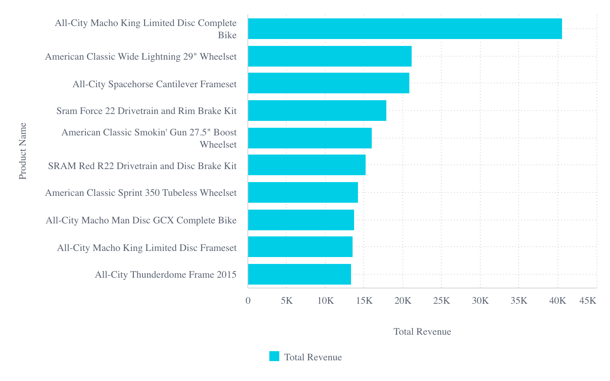

# Class Chart

A Vue component used for easily switching chart types or rendering multiple series of different chart types.

## Example

An example of using the `Chart` component to
plot a bar chart of the Sample Retail data source hosted in a Sisense instance:
```ts
<script setup lang="ts">
import { Chart } from '@sisense/sdk-ui-vue';
import type { ChartProps } from '@sisense/sdk-ui';
import * as DM from '../assets/sample-retail-model';
import { measureFactory, filterFactory } from '@sisense/sdk-data';
import { ref } from 'vue';

const dimProductName = DM.DimProducts.ProductName;
const measureTotalRevenue = measureFactory.sum(DM.Fact_Sale_orders.OrderRevenue, 'Total Revenue');

const chartProps = ref<ChartProps>({
  chartType: 'bar',
  dataSet: DM.DataSource,
  dataOptions: {
    category: [dimProductName],
    value: [{ column: measureTotalRevenue, sortType: 'sortDesc' }],
    breakBy: [],
  },
  filters: [filterFactory.topRanking(dimProductName, measureTotalRevenue, 10)],
  styleOptions: {
    width: 800,
    height: 500,
    xAxis: {
      title: {
        text: 'Product Name',
        enabled: true,
      },
    },
    yAxis: {
      title: {
        text: 'Total Revenue',
        enabled: true,
      },
    },
  },
});
</script>

<template>
  <Chart :props="chartProps" />
</template>
```



## Properties

### chartType

> **chartType**?: [`ChartType`](../../sdk-ui/type-aliases/type-alias.ChartType.md)

***

### dataOptions

> **dataOptions**?: [`ChartDataOptions`](../../sdk-ui/type-aliases/type-alias.ChartDataOptions.md)

***

### dataSet

> **dataSet**?: `string` \| [`Data`](../../sdk-data/interfaces/interface.Data.md)

***

### filters

> **filters**?: [`Filter`](../../sdk-data/interfaces/interface.Filter.md)[] \| [`FilterRelation`](../../sdk-data/interfaces/interface.FilterRelation.md)

***

### highlights

> **highlights**?: [`Filter`](../../sdk-data/interfaces/interface.Filter.md)[]

***

### onBeforeRender

> **onBeforeRender**?: [`BeforeRenderHandler`](../../sdk-ui/type-aliases/type-alias.BeforeRenderHandler.md)

***

### onDataPointClick

> **onDataPointClick**?: [`DataPointEventHandler`](../../sdk-ui/type-aliases/type-alias.DataPointEventHandler.md) \| [`ScatterDataPointEventHandler`](../../sdk-ui/type-aliases/type-alias.ScatterDataPointEventHandler.md)

***

### onDataPointContextMenu

> **onDataPointContextMenu**?: [`DataPointEventHandler`](../../sdk-ui/type-aliases/type-alias.DataPointEventHandler.md) \| [`ScatterDataPointEventHandler`](../../sdk-ui/type-aliases/type-alias.ScatterDataPointEventHandler.md)

***

### onDataPointsSelected

> **onDataPointsSelected**?: [`DataPointsEventHandler`](../../sdk-ui/type-aliases/type-alias.DataPointsEventHandler.md) \| [`ScatterDataPointsEventHandler`](../../sdk-ui/type-aliases/type-alias.ScatterDataPointsEventHandler.md)

***

### refreshCounter

> **refreshCounter**?: `number`

***

### styleOptions

> **styleOptions**?: [`ChartStyleOptions`](../../sdk-ui/type-aliases/type-alias.ChartStyleOptions.md)
