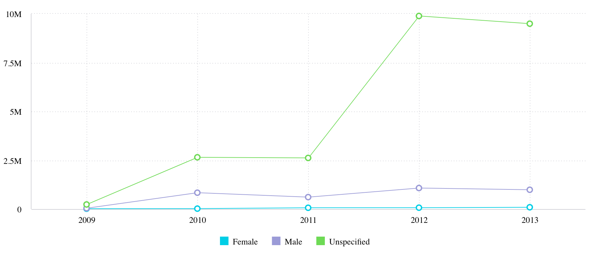

# Class LineChart

A Vue component that wraps the LineChart Preact component for use in Vue applications.
It maintains compatibility with Vue's reactivity system while preserving the functionality of the LineChart.

## Example

Here's how you can use the LineChart component in a Vue application:
```vue
<template>
     <LineChart
       :dataOptions="lineChartProps.dataOptions"
       :dataSet="lineChartProps.dataSet"
       :filters="lineChartProps.filters"
     />
</template>

<script setup lang="ts">
import { ref } from 'vue';
import {LineChart, type LineChartProps} from '@sisense/sdk-ui-vue';

const lineChartProps = ref<LineChartProps>({
 dataSet: DM.DataSource,
 dataOptions: {
   category: [dimProductName],
   value: [{ column: measureTotalRevenue, sortType: 'sortDesc' }],
   breakBy: [],
 },
 filters: [filterFactory.topRanking(dimProductName, measureTotalRevenue, 10)],
});
```


## Param

Line chart properties

## Properties

### dataOptions

> **dataOptions**?: [`CartesianChartDataOptions`](../interfaces/interface.CartesianChartDataOptions.md)

***

### dataSet

> **dataSet**?: [`DataSource`](../../sdk-data/type-aliases/type-alias.DataSource.md) \| [`Data`](../../sdk-data/interfaces/interface.Data.md)

***

### filters

> **filters**?: [`Filter`](../../sdk-data/interfaces/interface.Filter.md)[] \| [`FilterRelations`](../../sdk-data/interfaces/interface.FilterRelations.md)

***

### highlights

> **highlights**?: [`Filter`](../../sdk-data/interfaces/interface.Filter.md)[]

***

### onBeforeRender

> **onBeforeRender**?: [`BeforeRenderHandler`](../type-aliases/type-alias.BeforeRenderHandler.md)

***

### onDataPointClick

> **onDataPointClick**?: [`DataPointEventHandler`](../../sdk-ui/type-aliases/type-alias.DataPointEventHandler.md)

***

### onDataPointContextMenu

> **onDataPointContextMenu**?: [`DataPointEventHandler`](../../sdk-ui/type-aliases/type-alias.DataPointEventHandler.md)

***

### onDataPointsSelected

> **onDataPointsSelected**?: [`DataPointsEventHandler`](../../sdk-ui/type-aliases/type-alias.DataPointsEventHandler.md)

***

### styleOptions

> **styleOptions**?: [`LineStyleOptions`](../interfaces/interface.LineStyleOptions.md)
