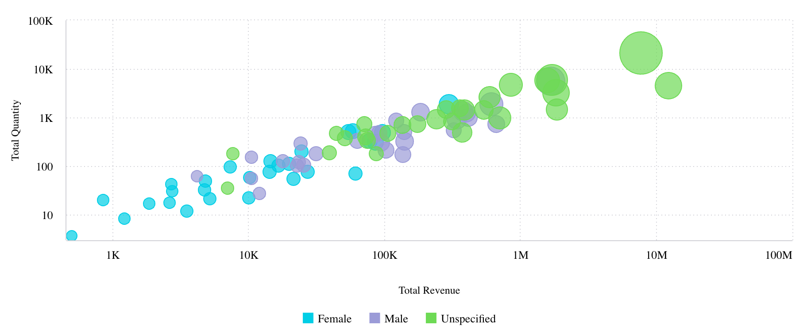

# Class ScatterChart

A Vue component displaying the distribution of two variables on an X-Axis, Y-Axis,
and two additional fields of data that are shown as colored circles scattered across the chart.

**Point**: A field that for each of its members a scatter point is drawn. The maximum amount of data points is 500.

**Size**: An optional field represented by the size of the circles.
If omitted, all scatter points are equal in size. If used, the circle sizes are relative to their values.

See [Scatter Chart](https://docs.sisense.com/main/SisenseLinux/scatter-chart.htm) for more information.

## Example

Here's how you can use the ScatterChart component in a Vue application:
```vue
<template>
     <ScatterChart
       :dataOptions="scatterChartProps.dataOptions"
       :dataSet="scatterChartProps.dataSet"
       :filters="scatterChartProps.filters"
     />
</template>

<script setup lang="ts">
import { ref } from 'vue';
import {ScatterChart, type ScatterChartProps} from '@sisense/sdk-ui-vue';

const scatterChartProps = ref<ScatterChartProps>({
 dataSet: DM.DataSource,
 dataOptions: {
   x: dimProductName,
   y: measureTotalRevenue,
 },
 filters: [filterFactory.topRanking(dimProductName, measureTotalRevenue, 10)],
});
```


## Param

Scatter chart properties

## Properties

### dataOptions

> **dataOptions**?: [`ScatterChartDataOptions`](../interfaces/interface.ScatterChartDataOptions.md)

***

### dataSet

> **dataSet**?: [`DataSource`](../../sdk-data/type-aliases/type-alias.DataSource.md) \| [`Data`](../../sdk-data/interfaces/interface.Data.md)

***

### filters

> **filters**?: [`Filter`](../../sdk-data/interfaces/interface.Filter.md)[] \| [`FilterRelations`](../../sdk-data/interfaces/interface.FilterRelations.md)

***

### highlights

> **highlights**?: [`Filter`](../../sdk-data/interfaces/interface.Filter.md)[]

***

### onBeforeRender

> **onBeforeRender**?: [`BeforeRenderHandler`](../type-aliases/type-alias.BeforeRenderHandler.md)

***

### onDataPointClick

> **onDataPointClick**?: [`ScatterDataPointEventHandler`](../../sdk-ui/type-aliases/type-alias.ScatterDataPointEventHandler.md)

***

### onDataPointContextMenu

> **onDataPointContextMenu**?: [`ScatterDataPointEventHandler`](../../sdk-ui/type-aliases/type-alias.ScatterDataPointEventHandler.md)

***

### onDataPointsSelected

> **onDataPointsSelected**?: [`ScatterDataPointsEventHandler`](../../sdk-ui/type-aliases/type-alias.ScatterDataPointsEventHandler.md)

***

### styleOptions

> **styleOptions**?: [`ScatterStyleOptions`](../interfaces/interface.ScatterStyleOptions.md)
