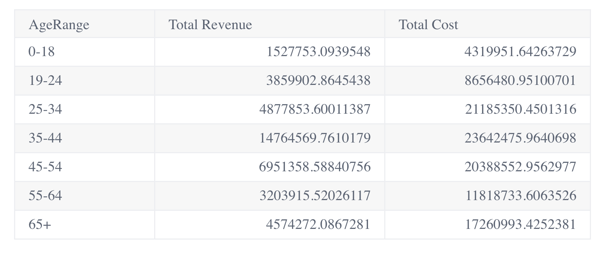

# Class Table

Table with aggregation and pagination.

## Example

Here's how you can use the Table component in a Vue application:
```vue
<template>
  <Table :props="tableProps" />
</template>

<script setup lang="ts">
import { ref } from 'vue';
import Table from '@sisense/sdk-ui-vue/Table';

const tableProps = ref({
  // Define your TableProps configuration here
});
</script>
```


## Param

Table properties

## Properties

### dataOptions

> **dataOptions**?: [`TableDataOptions`](../interfaces/interface.TableDataOptions.md)

***

### dataSet

> **dataSet**?: `string` \| [`Data`](../../sdk-data/interfaces/interface.Data.md)

***

### filters

> **filters**?: [`Filter`](../../sdk-data/interfaces/interface.Filter.md)[] \| [`FilterRelations`](../../sdk-data/interfaces/interface.FilterRelations.md)

***

### refreshCounter

> **refreshCounter**?: `number`

***

### styleOptions

> **styleOptions**?: [`TableStyleOptions`](../interfaces/interface.TableStyleOptions.md)
