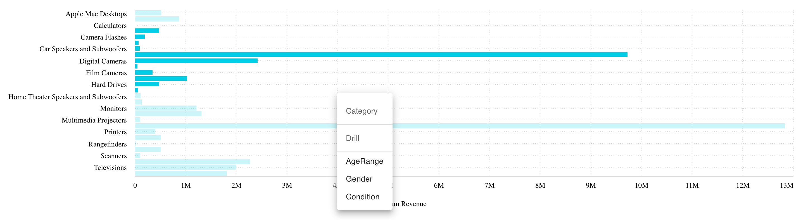

# Class ChartWidget

The Chart Widget component extending the [Chart](../charts/class.Chart.md) component to support widget style options.
It can be used along with the [DrilldownWidget](../drilldown/class.DrilldownWidget.md) component to support advanced data drilldown.

## Example

Here's how you can use the ChartWidget component in a Vue application:
```vue
<template>
   <DrilldownWidget :drilldownDimensions="drilldownDimensions" :initialDimension="dimProductName">
     <template
       #chart="{ drilldownFilters, drilldownDimension, onDataPointsSelected, onContextMenu }"
     >
       <ChartWidget
         chart-type="bar"
         v-bind:filters="drilldownFilters"
         :dataOptions="{
           ...chartProps.dataOptions,
           category: [drilldownDimension],
         }"
         :highlight-selection-disabled="true"
         :dataSet="chartProps.dataSet"
         :style="chartProps.styleOptions"
         :on-data-points-selected="(dataPoints:any,event:any) => {
         onDataPointsSelected(dataPoints);
         onContextMenu({ left: event.clientX, top: event.clientY });
       }"
         :on-data-point-click="(dataPoint:any,event:any) => {
         onDataPointsSelected([dataPoint]);
         onContextMenu({ left: event.clientX, top: event.clientY });
       }"
         :on-data-point-context-menu="(dataPoint:any,event:any) => {
         onDataPointsSelected([dataPoint]);
         onContextMenu({ left: event.clientX, top: event.clientY });
       }"
       />
     </template>
   </DrilldownWidget>
</template>

<script setup lang="ts">
import { ref } from 'vue';
import { measureFactory, filterFactory } from '@sisense/sdk-data';
import * as DM from '../assets/sample-retail-model';
import { ChartWidget } from '@sisense/sdk-ui-vue';

const dimProductName = DM.DimProducts.ProductName;
const measureTotalRevenue = measureFactory.sum(DM.Fact_Sale_orders.OrderRevenue, 'Total Revenue');
const chartWidgetProps = ref({
  // Configure your ChartWidgetProps here
});
</script>
```


## Param

ChartWidget properties

## Properties

### Data

#### dataSource

> **dataSource**?: [`DataSource`](../../sdk-data/type-aliases/type-alias.DataSource.md)

Data source the query is run against - e.g. `Sample ECommerce`

If not specified, the query will use the `defaultDataSource` specified in the parent Sisense Context.

***

#### filters

> **filters**?: [`Filter`](../../sdk-data/interfaces/interface.Filter.md)[] \| [`FilterRelations`](../../sdk-data/interfaces/interface.FilterRelations.md)

Filters that will slice query results

***

#### highlights

> **highlights**?: [`Filter`](../../sdk-data/interfaces/interface.Filter.md)[]

Highlight filters that will highlight results that pass filter criteria

### Chart

#### chartType

> **chartType**?: [`ChartType`](../type-aliases/type-alias.ChartType.md)

Default chart type of each series

***

#### dataOptions

> **dataOptions**?: [`ChartDataOptions`](../type-aliases/type-alias.ChartDataOptions.md)

Configurations for how to interpret and present the data passed to the chart

### Widget

#### description

> **description**?: `string`

Description of the widget

***

#### highlightSelectionDisabled

> **highlightSelectionDisabled**?: `boolean`

Boolean flag whether selecting data points triggers highlight filter of the selected data

Recommended to turn on when the Chart Widget component is enhanced with data drilldown by the Drilldown Widget component

If not specified, the default value is `false`

***

#### styleOptions

> **styleOptions**?: [`ChartWidgetStyleOptions`](../type-aliases/type-alias.ChartWidgetStyleOptions.md)

Style options for both the chart and widget including the widget header

***

#### title

> **title**?: `string`

Title of the widget

### Callbacks

#### onBeforeRender

> **onBeforeRender**?: [`BeforeRenderHandler`](../type-aliases/type-alias.BeforeRenderHandler.md)

A callback that allows you to customize the underlying chart element before it is rendered.
Use the `highchartsOptions` object that is passed to the callback to change
[options values](https://api.highcharts.com/highcharts/) and then return the modified options
object. The returned options are then used when rendering the chart.

This callback is not supported for Indicator Chart, Areamap Chart, and Scattermap Chart.

For an example of how the `onBeforeRender` callback can be used, see the
[Compose SDK Charts Guide](/guides/sdk/guides/charts/guide-compose-sdk-charts.html#callbacks).

***

#### onDataPointClick

> **onDataPointClick**?: [`DataPointEventHandler`](../../sdk-ui/type-aliases/type-alias.DataPointEventHandler.md) \| [`ScatterDataPointEventHandler`](../../sdk-ui/type-aliases/type-alias.ScatterDataPointEventHandler.md) \| [`AreamapDataPointEventHandler`](../../sdk-ui/type-aliases/type-alias.AreamapDataPointEventHandler.md) \| [`BoxplotDataPointEventHandler`](../../sdk-ui/type-aliases/type-alias.BoxplotDataPointEventHandler.md) \| [`ScattermapDataPointEventHandler`](../../sdk-ui/type-aliases/type-alias.ScattermapDataPointEventHandler.md)

Click handler callback for a data point

***

#### onDataPointContextMenu

> **onDataPointContextMenu**?: [`DataPointEventHandler`](../../sdk-ui/type-aliases/type-alias.DataPointEventHandler.md) \| [`ScatterDataPointEventHandler`](../../sdk-ui/type-aliases/type-alias.ScatterDataPointEventHandler.md) \| [`BoxplotDataPointEventHandler`](../../sdk-ui/type-aliases/type-alias.BoxplotDataPointEventHandler.md)

Context menu handler callback for a data point

***

#### onDataPointsSelected

> **onDataPointsSelected**?: [`DataPointsEventHandler`](../../sdk-ui/type-aliases/type-alias.DataPointsEventHandler.md) \| [`ScatterDataPointsEventHandler`](../../sdk-ui/type-aliases/type-alias.ScatterDataPointsEventHandler.md)

Handler callback for selection of multiple data points
