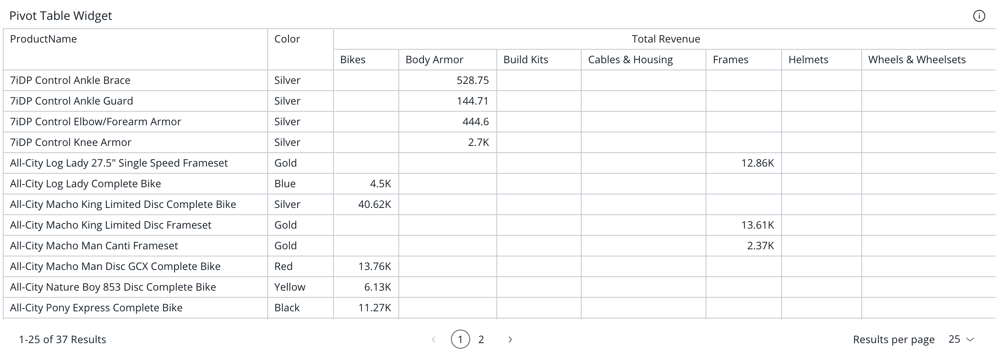

# Class PivotTableWidget

The PivotTableWidget component extending the [PivotTable](../data-grids/class.PivotTable.md) component to support widget style options.

## Example

Here's how you can use the PivotTableWidget component in a Vue application:
```vue
<template>
  <PivotTableWidget
     :dataSource="pivotTableWidgetProps.dataSource"
     :filters="pivotTableWidgetProps.filters"
     :dataOptions="pivotTableWidgetProps.dataOptions"
     :styleOptions="pivotTableWidgetProps.styleOptions"
     :title="pivotTableWidgetProps.title"
  />
</template>

<script setup lang="ts">
import { ref } from 'vue';
import { measureFactory } from '@sisense/sdk-data';
import { PivotTableWidget, type PivotTableWidgetProps } from '@sisense/sdk-ui-vue';
import * as DM from '../assets/sample-ecommerce-model';

const pivotTableWidgetProps = ref<PivotTableWidgetProps>({
  dataSource: DM.DataSource,
  dataOptions: {
    rows: [DM.Category.Category],
    values: [measureFactory.sum(DM.Commerce.Cost, 'Total Cost')],
  },
  filters: [],
  title: 'Pivot Table Widget Example',
  styleOptions: {
    spaceAround: 'Medium',
    cornerRadius: 'Large',
    shadow: 'Light',
    border: true,
    borderColor: '#e0e0e0',
    backgroundColor: '#ffffff',
    header: {
      hidden: false,
      titleTextColor: '#333333',
      titleAlignment: 'Center',
      dividerLine: true,
      dividerLineColor: '#e0e0e0',
      backgroundColor: '#f5f5f5',
    },
  },
});
</script>
```


## Param

Pivot Table Widget properties

## Properties

### Data

#### dataSource

> **`readonly`** **dataSource**?: [`DataSource`](../../sdk-data/type-aliases/type-alias.DataSource.md)

Data source the query is run against - e.g. `Sample ECommerce`

If not specified, the query will use the `defaultDataSource` specified in the parent Sisense Context.

***

#### filters

> **`readonly`** **filters**?: [`FilterRelations`](../../sdk-data/interfaces/interface.FilterRelations.md) \| [`Filter`](../../sdk-data/interfaces/interface.Filter.md)[]

Filters that will slice query results

***

#### highlights

> **`readonly`** **highlights**?: [`Filter`](../../sdk-data/interfaces/interface.Filter.md)[]

Filters that will highlight query results

### Chart

#### dataOptions

> **`readonly`** **dataOptions**: [`PivotTableDataOptions`](../interfaces/interface.PivotTableDataOptions.md)

Configurations for how to interpret and present the data passed to the table

### Widget

#### description

> **`readonly`** **description**?: `string`

Description of the widget

***

#### drilldownOptions

> **`readonly`** **drilldownOptions**?: [`PivotTableDrilldownOptions`](../type-aliases/type-alias.PivotTableDrilldownOptions.md)

Configuration for the pivot table drilldown

***

#### styleOptions

> **`readonly`** **styleOptions**?: [`PivotTableWidgetStyleOptions`](../../sdk-ui/type-aliases/type-alias.PivotTableWidgetStyleOptions.md)

Style options for both the table and widget including the widget header

***

#### title

> **`readonly`** **title**?: `string`

Title of the widget

### Callbacks

#### onDataPointClick

> **`readonly`** **onDataPointClick**?: [`PivotTableDataPointEventHandler`](../../sdk-ui/type-aliases/type-alias.PivotTableDataPointEventHandler.md)

Callback function that is called when the pivot table cell is clicked

***

#### onDataPointContextMenu

> **`readonly`** **onDataPointContextMenu**?: [`PivotTableDataPointEventHandler`](../../sdk-ui/type-aliases/type-alias.PivotTableDataPointEventHandler.md)

Callback function that is called when the pivot table cell is right-clicked
