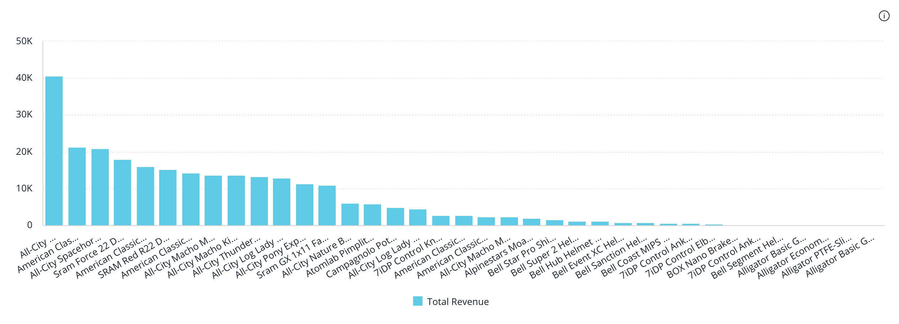

# Class Widget

Facade component that renders a widget within a dashboard based on the widget type.

## Example

```vue
<script setup lang="ts">
import { Widget, type WidgetProps } from '@sisense/sdk-ui-vue';
import { measureFactory } from '@sisense/sdk-data';

const widgetProps: WidgetProps = {
  id: 'widget-id',
  widgetType: 'chart',
  dataSource: DM.DataSource,
  chartType: 'column',
  dataOptions: {
    category: [dimProductName],
    value: [
      {
        column: measureFactory.sum(DM.Fact_Sale_orders.OrderRevenue, 'Total Revenue'),
        sortType: 'sortDesc',
      },
    ],
    breakBy: [],
  },
};
</script>

<template>
  <Widget
    :id="widgetProps.id"
    :widgetType="widgetProps.widgetType"
    :dataSource="widgetProps.dataSource"
    :chartType="widgetProps.chartType"
    :dataOptions="widgetProps.dataOptions"
  />
</template>
```


## Properties

### Data

#### dataSource

> **`readonly`** **dataSource**?: [`DataSource`](../../sdk-data/type-aliases/type-alias.DataSource.md)

Data source the query is run against - e.g. `Sample ECommerce`

If not specified, the query will use the `defaultDataSource` specified in the parent Sisense Context.

***

#### filters

> **`readonly`** **filters**?: [`FilterRelations`](../../sdk-data/interfaces/interface.FilterRelations.md) \| [`Filter`](../../sdk-data/interfaces/interface.Filter.md)[]

Filters that will slice query results

***

#### highlights

> **`readonly`** **highlights**?: [`Filter`](../../sdk-data/interfaces/interface.Filter.md)[]

Highlight filters that will highlight results that pass filter criteria

### Chart

#### chartType

> **`readonly`** **chartType**?: [`ChartType`](../type-aliases/type-alias.ChartType.md)

Default chart type of each series

***

#### dataOptions

> **`readonly`** **dataOptions**?: [`ChartDataOptions`](../type-aliases/type-alias.ChartDataOptions.md) \| [`GenericDataOptions`](../type-aliases/type-alias.GenericDataOptions.md) \| [`PivotTableDataOptions`](../interfaces/interface.PivotTableDataOptions.md)

Configurations for how to interpret and present the data passed to the chart

### Widget

#### customWidgetType

> **`readonly`** **customWidgetType**?: `string`

Custom widget type. This is typically the name/ID of the custom widget.

***

#### description

> **`readonly`** **description**?: `string`

Description of the widget

***

#### drilldownOptions

> **`readonly`** **drilldownOptions**?: [`DrilldownOptions`](../type-aliases/type-alias.DrilldownOptions.md)

List of categories to allow drilldowns on

***

#### id

> **`readonly`** **id**: `string`

Unique identifier of the widget

***

#### styleOptions

> **`readonly`** **styleOptions**?: [`ChartWidgetStyleOptions`](../type-aliases/type-alias.ChartWidgetStyleOptions.md) \| [`CustomWidgetStyleOptions`](../../sdk-ui/type-aliases/type-alias.CustomWidgetStyleOptions.md) \| [`PivotTableWidgetStyleOptions`](../../sdk-ui/type-aliases/type-alias.PivotTableWidgetStyleOptions.md) \| [`TextWidgetStyleOptions`](../../sdk-ui/type-aliases/type-alias.TextWidgetStyleOptions.md)

Style options for both the chart and widget including the widget header

***

#### title

> **`readonly`** **title**?: `string`

Title of the widget

***

#### widgetType

> **`readonly`** **widgetType**: `"chart"` \| `"custom"` \| `"pivot"` \| `"text"`

Widget type

### Callbacks

#### onBeforeRender

> **`readonly`** **onBeforeRender**?: [`BeforeRenderHandler`](../type-aliases/type-alias.BeforeRenderHandler.md) \| [`IndicatorBeforeRenderHandler`](../type-aliases/type-alias.IndicatorBeforeRenderHandler.md)

A callback that allows you to customize the underlying chart element before it is rendered. The returned options are then used when rendering the chart.

This callback is not supported for Areamap Chart, Scattermap Chart, Table, and PivotTable.

***

#### onDataPointClick

> **`readonly`** **onDataPointClick**?: [`AreamapDataPointEventHandler`](../../sdk-ui/type-aliases/type-alias.AreamapDataPointEventHandler.md) \| [`BoxplotDataPointEventHandler`](../../sdk-ui/type-aliases/type-alias.BoxplotDataPointEventHandler.md) \| [`CalendarHeatmapDataPointEventHandler`](../../sdk-ui/type-aliases/type-alias.CalendarHeatmapDataPointEventHandler.md) \| [`DataPointEventHandler`](../../sdk-ui/type-aliases/type-alias.DataPointEventHandler.md) \| [`IndicatorDataPointEventHandler`](../../sdk-ui/type-aliases/type-alias.IndicatorDataPointEventHandler.md) \| [`PivotTableDataPointEventHandler`](../../sdk-ui/type-aliases/type-alias.PivotTableDataPointEventHandler.md) \| [`ScatterDataPointEventHandler`](../../sdk-ui/type-aliases/type-alias.ScatterDataPointEventHandler.md) \| [`ScattermapDataPointEventHandler`](../../sdk-ui/type-aliases/type-alias.ScattermapDataPointEventHandler.md) \| `TextWidgetDataPointEventHandler`

Click handler callback for a data point

***

#### onDataPointContextMenu

> **`readonly`** **onDataPointContextMenu**?: [`BoxplotDataPointEventHandler`](../../sdk-ui/type-aliases/type-alias.BoxplotDataPointEventHandler.md) \| [`CalendarHeatmapDataPointEventHandler`](../../sdk-ui/type-aliases/type-alias.CalendarHeatmapDataPointEventHandler.md) \| [`DataPointEventHandler`](../../sdk-ui/type-aliases/type-alias.DataPointEventHandler.md) \| [`PivotTableDataPointEventHandler`](../../sdk-ui/type-aliases/type-alias.PivotTableDataPointEventHandler.md) \| [`ScatterDataPointEventHandler`](../../sdk-ui/type-aliases/type-alias.ScatterDataPointEventHandler.md)

Context menu handler callback for a data point

***

#### onDataPointsSelected

> **`readonly`** **onDataPointsSelected**?: [`CalendarHeatmapDataPointsEventHandler`](../../sdk-ui/type-aliases/type-alias.CalendarHeatmapDataPointsEventHandler.md) \| [`DataPointsEventHandler`](../../sdk-ui/type-aliases/type-alias.DataPointsEventHandler.md) \| [`ScatterDataPointsEventHandler`](../../sdk-ui/type-aliases/type-alias.ScatterDataPointsEventHandler.md)

Handler callback for selection of multiple data points

***

#### onDataReady

> **`readonly`** **onDataReady**?: (`data`) => [`Data`](../../sdk-data/interfaces/interface.Data.md)

A callback that allows to modify data immediately after it has been retrieved.
Can be used to inject modification of queried data.

##### Parameters

| Parameter | Type |
| :------ | :------ |
| `data` | [`Data`](../../sdk-data/interfaces/interface.Data.md) |

##### Returns

[`Data`](../../sdk-data/interfaces/interface.Data.md)
