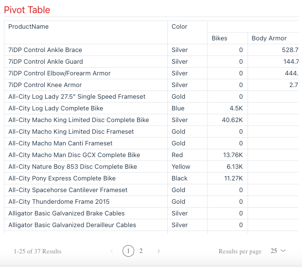

# Class PivotTable <Badge type="beta" text="Beta" />

A Vue component for Pivot table with pagination.

## Example

Here's how you can use the PivotTable component in a Vue application:
```vue
<template>
   <PivotTable :dataOptions="pivotTableProps.dataOptions" :dataSet="pivotTableProps.dataSet"
       :styleOptions="pivotTableProps.styleOptions" :filters="pivotTableProps.filters" />
</template>

<script setup lang="ts">
import { ref } from 'vue';
import { measureFactory, filterFactory } from '@sisense/sdk-data';
import * as DM from '../assets/sample-retail-model';
import {PivotTable, type PivotTableProps} from '@sisense/sdk-ui-vue/Table';

const dimProductName = DM.DimProducts.ProductName;
const measureTotalRevenue = measureFactory.sum(DM.Fact_Sale_orders.OrderRevenue, 'Total Revenue');
const pivotTableProps = ref<PivotTableProps>({
 dataSet: DM.DataSource,
 dataOptions: {
   rows: [dimProductName, dimColor],
   columns: [dimCategoryName],
   values: [measureTotalRevenue],
 },
 styleOptions: {
   width: 1200,
   height: 500,
 },
 filters: [filterFactory.topRanking(dimProductName, measureTotalRevenue, 1000)],
});
</script>
```


## Properties

### Data

#### dataOptions

> **dataOptions**?: [`PivotTableDataOptions`](../interfaces/interface.PivotTableDataOptions.md)

Configurations for how to interpret and present the data passed to the component

***

#### dataSet

> **dataSet**?: [`DataSource`](../../sdk-data/type-aliases/type-alias.DataSource.md)

Data source name (as a `string`) - e.g. `Sample ECommerce`.

If not specified, the component will use the `defaultDataSource` specified in the parent Sisense Context.

***

#### filters

> **filters**?: [`Filter`](../../sdk-data/interfaces/interface.Filter.md)[] \| [`FilterRelations`](../../sdk-data/interfaces/interface.FilterRelations.md)

Filters that will slice query results

***

#### highlights

> **highlights**?: [`Filter`](../../sdk-data/interfaces/interface.Filter.md)[]

Filters that will highlight query results

### Representation

#### styleOptions

> **styleOptions**?: [`PivotTableStyleOptions`](../interfaces/interface.PivotTableStyleOptions.md)

Configurations for how to style and present a pivot table's data.
