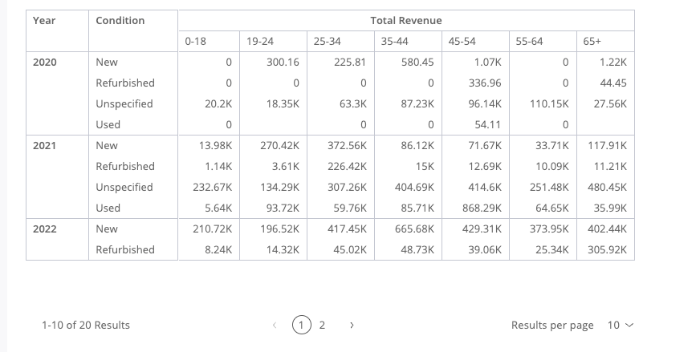
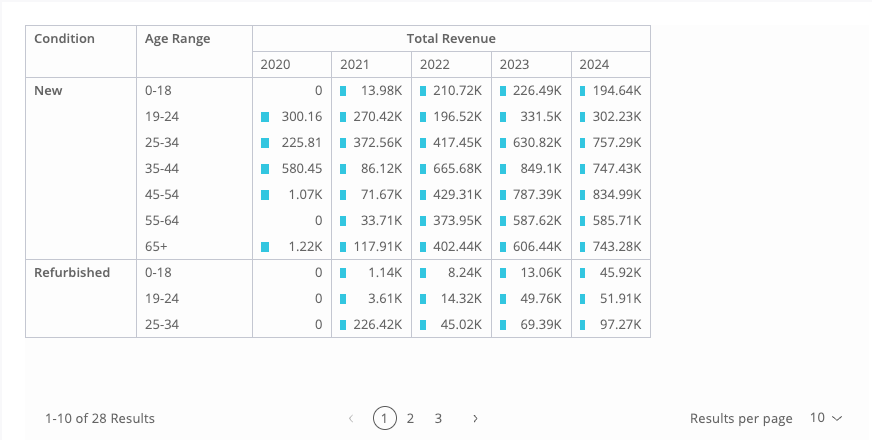
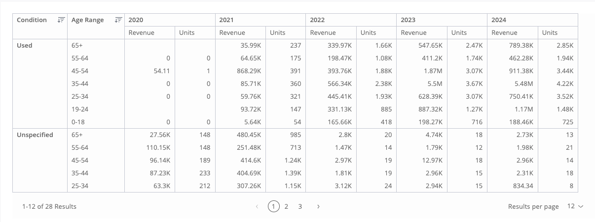
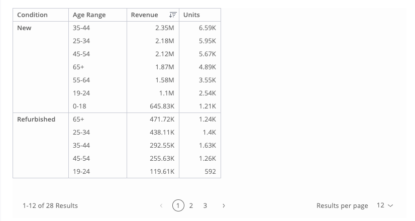
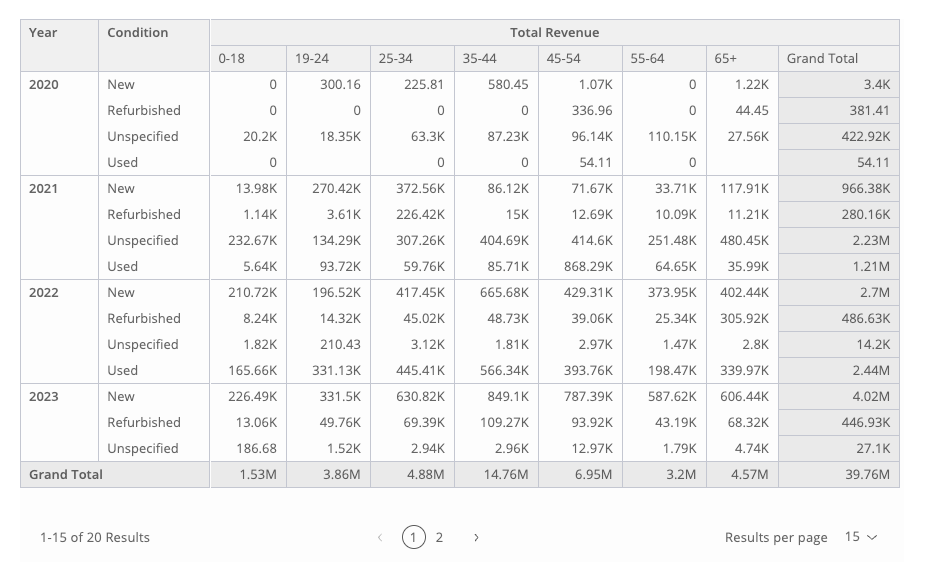
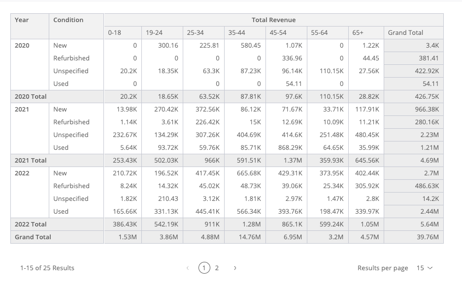

# Class PivotTable

A Vue component for Pivot table with pagination.

## Example

```vue
<script setup lang="ts">
import { ref } from 'vue';
import { PivotTable } from '@sisense/sdk-ui-vue';
import * as DM from './sample-ecommerce';
import { measureFactory } from '@sisense/sdk-data';

const pivotTableProps = ref({
  dataOptions: {
    rows: [
      {
        column: DM.Commerce.Date.Years,
        dateFormat: 'yyyy',
        name: 'Year',
      },
      DM.Commerce.Condition,
    ],
    columns: [DM.Commerce.AgeRange],
    values: [measureFactory.sum(DM.Commerce.Revenue, 'Total Revenue')],
  },
  styleOptions: {
    rowsPerPage: 10,
    height: 425,
    width: 800,
  },
});
</script>

<template>
  <PivotTable
    :dataSet="DM.DataSource"
    :dataOptions="pivotTableProps.dataOptions"
    :styleOptions="pivotTableProps.styleOptions"
  />
</template>
```



Additional examples:

Highlighting relative magnitude within a column with data bars:
```vue
<script setup lang="ts">
import { ref } from 'vue';
import { PivotTable } from '@sisense/sdk-ui-vue';
import * as DM from './sample-ecommerce';
import { measureFactory } from '@sisense/sdk-data';

const pivotTableProps = ref({
  dataOptions: {
    rows: [DM.Commerce.Condition, DM.Commerce.AgeRange],
    columns: [
      {
        column: DM.Commerce.Date.Years,
        dateFormat: 'yyyy',
        name: 'Year',
      },
    ],
    values: [
      {
        column: measureFactory.sum(DM.Commerce.Revenue, 'Total Revenue'),
        dataBars: true,
      },
    ],
  },
  styleOptions: {
    rowsPerPage: 10,
    height: 425,
    width: 850,
  },
});
</script>

<template>
  <PivotTable
    :dataSet="DM.DataSource"
    :dataOptions="pivotTableProps.dataOptions"
    :styleOptions="pivotTableProps.styleOptions"
  />
</template>
```



Sorting rows: `Condition` and `Age Range` rows sorted directly by their own values (equivalent to a user clicking a row heading and choosing Sort Descending):
```vue
<script setup lang="ts">
import { ref } from 'vue';
import { PivotTable } from '@sisense/sdk-ui-vue';
import * as DM from './sample-ecommerce';
import { measureFactory } from '@sisense/sdk-data';

const pivotTableProps = ref({
  dataOptions: {
    rows: [
      {
        column: DM.Commerce.Condition,
        sortType: 'sortDesc',
      },
      {
        column: DM.Commerce.AgeRange,
        sortType: 'sortDesc',
      },
    ],
    columns: [{ column: DM.Commerce.Date.Years }],
    values: [
      { column: measureFactory.sum(DM.Commerce.Revenue, 'Revenue') },
      { column: measureFactory.sum(DM.Commerce.Quantity, 'Units') },
    ],
  },
  styleOptions: {
    rowsPerPage: 12,
    height: 425,
    width: 1200,
  },
});
</script>

<template>
  <PivotTable
    :dataSet="DM.DataSource"
    :dataOptions="pivotTableProps.dataOptions"
    :styleOptions="pivotTableProps.styleOptions"
  />
</template>
```



Sorting rows by a value column: `Age Range` sorted by its `Revenue` values (equivalent to a user clicking the `Revenue` value heading and sorting `Age Range` Descending):
```vue
<script setup lang="ts">
import { ref } from 'vue';
import { PivotTable } from '@sisense/sdk-ui-vue';
import * as DM from './sample-ecommerce';
import { measureFactory } from '@sisense/sdk-data';

const pivotTableProps = ref({
  dataOptions: {
    rows: [
      DM.Commerce.Condition,
      {
        column: DM.Commerce.AgeRange,
        sortType: {
          direction: 'sortDesc',
          by: {
            valuesIndex: 0,
          },
        },
      },
    ],
    values: [
      measureFactory.sum(DM.Commerce.Revenue, 'Revenue'),
      measureFactory.sum(DM.Commerce.Quantity, 'Units'),
    ],
  },
  styleOptions: {
    rowsPerPage: 12,
    height: 425,
    width: 800,
  },
});
</script>

<template>
  <PivotTable
    :dataSet="DM.DataSource"
    :dataOptions="pivotTableProps.dataOptions"
    :styleOptions="pivotTableProps.styleOptions"
  />
</template>
```



Grand totals across rows and columns:
```vue
<script setup lang="ts">
import { ref } from 'vue';
import { PivotTable } from '@sisense/sdk-ui-vue';
import * as DM from './sample-ecommerce';
import { measureFactory } from '@sisense/sdk-data';

const pivotTableProps = ref({
  dataOptions: {
    rows: [
      {
        column: DM.Commerce.Date.Years,
        dateFormat: 'yyyy',
        name: 'Year',
      },
      DM.Commerce.Condition,
    ],
    columns: [DM.Commerce.AgeRange],
    values: [measureFactory.sum(DM.Commerce.Revenue, 'Total Revenue')],
    grandTotals: {
      rows: true,
      columns: true,
    },
  },
  styleOptions: {
    rowsPerPage: 15,
    height: 550,
    width: 900,
    totalsColor: true,
    headersColor: true,
  },
});
</script>

<template>
  <PivotTable
    :dataSet="DM.DataSource"
    :dataOptions="pivotTableProps.dataOptions"
    :styleOptions="pivotTableProps.styleOptions"
  />
</template>
```



Grand totals plus a subtotal row per `Year`, via [PivotTableDataOptions.rows](../interfaces/interface.PivotTableDataOptions.md#rows)' `includeSubTotals`:
```vue
<script setup lang="ts">
import { ref } from 'vue';
import { PivotTable } from '@sisense/sdk-ui-vue';
import * as DM from './sample-ecommerce';
import { measureFactory } from '@sisense/sdk-data';

const pivotTableProps = ref({
  dataOptions: {
    rows: [
      {
        column: DM.Commerce.Date.Years,
        dateFormat: 'yyyy',
        name: 'Year',
        includeSubTotals: true,
      },
      DM.Commerce.Condition,
    ],
    columns: [DM.Commerce.AgeRange],
    values: [measureFactory.sum(DM.Commerce.Revenue, 'Total Revenue')],
    grandTotals: {
      rows: true,
      columns: true,
    },
  },
  styleOptions: {
    rowsPerPage: 15,
    height: 550,
    width: 900,
    totalsColor: true,
    headersColor: true,
  },
});
</script>

<template>
  <PivotTable
    :dataSet="DM.DataSource"
    :dataOptions="pivotTableProps.dataOptions"
    :styleOptions="pivotTableProps.styleOptions"
  />
</template>
```



## Remarks

Configuration options can also be applied within the scope of a `<SisenseContextProvider>` to control the default behavior of PivotTable, by changing available settings within `appConfig.chartConfig.tabular.*`

Follow the link to [AppConfig](../type-aliases/type-alias.AppConfig.md) for more details on the available settings.

## Properties

### Data

#### dataOptions

> **`readonly`** **dataOptions**: [`PivotTableDataOptions`](../interfaces/interface.PivotTableDataOptions.md)

Configurations for how to interpret and present the data passed to the component

***

#### dataSet

> **`readonly`** **dataSet**?: [`DataSource`](../../sdk-data/type-aliases/type-alias.DataSource.md)

Data source name (as a `string`) - e.g. `Sample ECommerce`.

If not specified, the component will use the `defaultDataSource` specified in the parent Sisense Context.

***

#### filters

> **`readonly`** **filters**?: [`FilterRelations`](../../sdk-data/interfaces/interface.FilterRelations.md) \| [`Filter`](../../sdk-data/interfaces/interface.Filter.md)[]

Filters that will slice query results

***

#### highlights

> **`readonly`** **highlights**?: [`Filter`](../../sdk-data/interfaces/interface.Filter.md)[]

Filters that will highlight query results.

NOTE that highlight filters in the "Include all" state are silently omitted from the
query. To clear a highlight, remove it from the array.

### Callbacks

#### onDataPointClick

> **`readonly`** **onDataPointClick**?: [`PivotTableDataPointEventHandler`](../../sdk-ui/type-aliases/type-alias.PivotTableDataPointEventHandler.md)

Callback function that is called when the pivot table cell is clicked

***

#### onDataPointContextMenu

> **`readonly`** **onDataPointContextMenu**?: [`PivotTableDataPointEventHandler`](../../sdk-ui/type-aliases/type-alias.PivotTableDataPointEventHandler.md)

Callback function that is called when the pivot table cell is right-clicked

### Representation

#### styleOptions

> **`readonly`** **styleOptions**?: [`PivotTableStyleOptions`](../interfaces/interface.PivotTableStyleOptions.md)

Configurations for how to style and present a pivot table's data.
