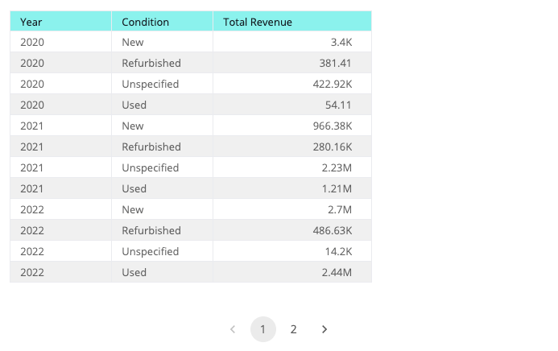

# Class Table

Table with aggregation and pagination.

## Example

```vue
<script setup lang="ts">
import { ref } from 'vue';
import { Table } from '@sisense/sdk-ui-vue';
import { measureFactory } from '@sisense/sdk-data';
import * as DM from './sample-ecommerce';

const tableProps = ref({
  dataOptions: {
    columns: [
      { column: DM.Commerce.Date.Years, name: 'Year', dateFormat: 'yyyy' },
      DM.Commerce.Condition,
      measureFactory.sum(DM.Commerce.Revenue, 'Total Revenue'),
    ],
  },
  styleOptions: {
    rowsPerPage: 12,
    height: 420,
    header: { color: { enabled: true, backgroundColor: '#94F5F0', textColor: '#121A23' } },
    rows: { alternatingColor: { enabled: true, backgroundColor: '#f2f2f2' } },
  },
});
</script>

<template>
  <Table
    :dataSet="DM.DataSource"
    :dataOptions="tableProps.dataOptions"
    :styleOptions="tableProps.styleOptions"
  />
</template>
```


## Param

Table properties

## Properties

### Data

#### dataOptions

> **`readonly`** **dataOptions**: [`TableDataOptions`](../interfaces/interface.TableDataOptions.md)

Configurations for how to interpret and present the data passed to the component

***

#### dataSet

> **`readonly`** **dataSet**?: [`Data`](../../sdk-data/interfaces/interface.Data.md) \| [`DataSource`](../../sdk-data/type-aliases/type-alias.DataSource.md)

Data set for a chart using one of the following options. If neither option is specified, the chart
will use the `defaultDataSource` specified in the parent `SisenseContextProvider`
component.

(1) Sisense data source name as a string. For example, `'Sample ECommerce'`. Typically, you
retrieve the data source name from a data model you create using the `get-data-model`
[command](https://developer.sisense.com/guides/sdk/guides/cli.html) of the Compose SDK CLI. The chart
connects to the data source, executes a query, and loads the data as specified in
`dataOptions`, `filters`, and `highlights`.

To learn more about using data from a Sisense data source, see the
[Compose SDK Charts Guide](/guides/sdk/guides/charts/guide-compose-sdk-charts.html#sisense-data).

OR

(2) Explicit [`Data`](../../sdk-data/interfaces/interface.Data.md), which is made up of an array of
[`Column`](../../sdk-data/interfaces/interface.Column.md) objects and a two-dimensional array of row data. This approach
allows the chart component to be used with any data you provide.

To learn more about using data from an external data source, see the
[Compose SDK Charts Guide](/guides/sdk/guides/charts/guide-compose-sdk-charts.html#explicit-data).

Example data in the proper format:

```ts
const sampleData = {
  columns: [
    { name: 'Years', type: 'date' },
    { name: 'Quantity', type: 'number' },
    { name: 'Units', type: 'number' },
  ],
  rows: [
    ['2019', 5500, 1500],
    ['2020', 4471, 7000],
    ['2021', 1812, 5000],
    ['2022', 5001, 6000],
    ['2023', 2045, 4000],
  ],
};
```

***

#### filters

> **`readonly`** **filters**?: [`FilterRelations`](../../sdk-data/interfaces/interface.FilterRelations.md) \| [`Filter`](../../sdk-data/interfaces/interface.Filter.md)[]

Filters that will slice query results

### Callbacks

#### onDataReady

> **`readonly`** **onDataReady**?: (`data`) => [`Data`](../../sdk-data/interfaces/interface.Data.md)

A callback that allows to modify data immediately after it has been retrieved.
It can be used to inject modification of queried data.

##### Parameters

| Parameter | Type |
| :------ | :------ |
| `data` | [`Data`](../../sdk-data/interfaces/interface.Data.md) |

##### Returns

[`Data`](../../sdk-data/interfaces/interface.Data.md)

### Representation

#### styleOptions

> **`readonly`** **styleOptions**?: [`TableStyleOptions`](../interfaces/interface.TableStyleOptions.md)

Configurations for how to style and present a table's data.
