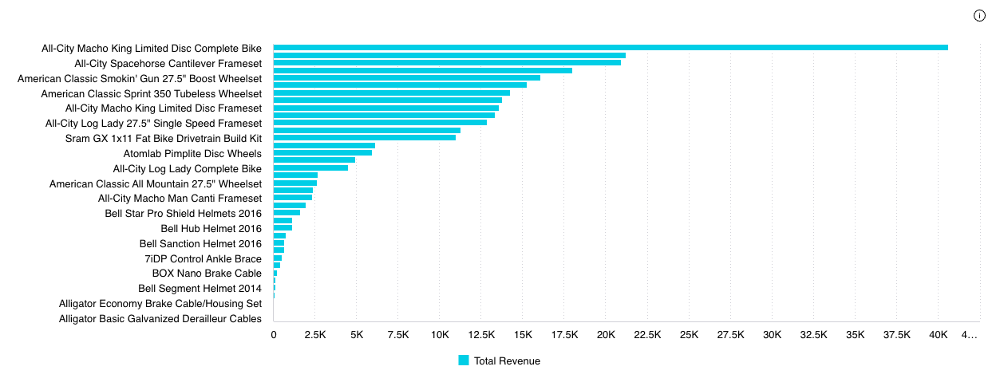

# Class DrilldownWidget

Vue component designed to add drilldown functionality to any type of chart

It acts as a wrapper around a given chart component, enhancing it with drilldown capabilities

The widget offers several features including:
- A context menu for initiating drilldown actions (can be provided as a custom component)
- Breadcrumbs that not only allow for drilldown selection slicing but also
provide an option to clear the selection (can be provided as a custom component)
- Filters specifically created for drilldown operation
- An option to navigate to the next drilldown dimension

When an `initialDimension` is specified, the `drilldownDimension` will automatically inherit its value,
even before any points on the chart are selected.
This allows for complete control over the chart's dimensions to be handed over to the DrilldownWidget

## Example

Here's how to use the `DrilldownWidget` component:
```vue
<template>
       <DrilldownWidget
         :drilldownDimensions="drilldownDimensions"
         :initialDimension="dimProductName"
       >
         <template
           #chart="{ drilldownFilters, drilldownDimension, onDataPointsSelected, onContextMenu }"
         >
           <ChartWidget
             chart-type="bar"
             v-bind:filters="drilldownFilters"
             :dataOptions="{
               ...chartProps.dataOptions,
               category: [drilldownDimension],
             }"
             :highlight-selection-disabled="true"
             :dataSet="chartProps.dataSet"
             :style="chartProps.styleOptions"
             :on-data-points-selected="(dataPoints: any, event: any) => {
               onDataPointsSelected(dataPoints);
               onContextMenu({ left: event.clientX, top: event.clientY });
             }"
             :on-data-point-click="(dataPoint: any, event: any) => {
               onDataPointsSelected([dataPoint]);
               onContextMenu({ left: event.clientX, top: event.clientY });
             }"
                           :on-data-point-context-menu="(dataPoint: any, event: any) => {
               onDataPointsSelected([dataPoint]);
               onContextMenu({ left: event.clientX, top: event.clientY });
             }"
           />
         </template>
       </DrilldownWidget>
</template>

<script>
import { ref } from 'vue';
import { DrilldownWidget } from '@sisense/sdk-ui-vue';

const chartProps = ref<ChartProps>({
 chartType: 'bar',
 dataSet: DM.DataSource,
 dataOptions: {
   category: [dimProductName],
   value: [{ column: measureTotalRevenue, sortType: 'sortDesc' }],
   breakBy: [],
 },
 filters: [filterFactory.topRanking(dimProductName, measureTotalRevenue, 10)],
 styleOptions: {
   xAxis: {
     title: {
       text: 'Product Name',
       enabled: true,
     },
   },
   yAxis: {
     title: {
       text: 'Total Revenue',
       enabled: true,
     },
   },
 },
});
const drilldownDimensions = [DM.DimCountries.CountryName, DM.DimProducts.ProductName];
const dimProductName = DM.DimProducts.ProductName;
</script>
```


## Param

DrilldownWidget properties

## Properties

### config

> **`readonly`** **config**: [`DrilldownWidgetConfig`](../type-aliases/type-alias.DrilldownWidgetConfig.md)

***

### drilldownDimensions

> **`readonly`** **drilldownDimensions**: [`Attribute`](../../sdk-data/interfaces/interface.Attribute.md)[]

***

### initialDimension

> **`readonly`** **initialDimension**: [`Attribute`](../../sdk-data/interfaces/interface.Attribute.md)
