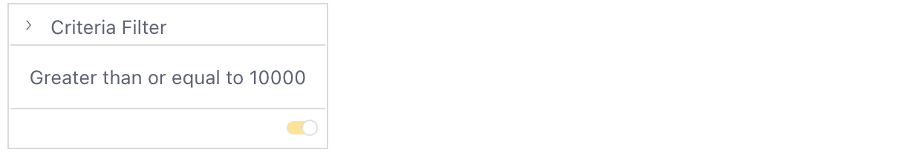

# Class CriteriaFilterTile

UI component that allows the user to filter numeric or text attributes according to
a number of built-in operations defined in the NumericFilter, TextFilter, or RankingFilter.

The arrangement prop determines whether the filter is rendered vertically or horizontally, with the latter intended for toolbar use and omitting title, enable/disable, and collapse/expand functionality.

## Example

Here's how you can use the CriteriaFilterTile component in a Vue application:
```vue
<template>
  <CriteriaFilterTile
    :title="criteriaFilterTileProps.title"
    :filter="criteriaFilterTileProps.filter"
    :onUpdate="onUpdate"
  />
</template>

<script setup lang="ts">
import { ref } from 'vue';
import {CriteriaFilterTile} from '@sisense/sdk-ui-vue';
import { filterFactory } from '@sisense/sdk-data';

const criteriaFilterTileProps = ref({
 title: 'Revenue',
 filter: filterFactory.greaterThanOrEqual(DM.Commerce.Revenue, 10000)
});

const onUpdate = (filter: Filter | null) => {
 ...
}
</script>
```


## Param

Criteria filter tile props

## Properties

### arrangement

> **arrangement**?: [`FilterVariant`](../type-aliases/type-alias.FilterVariant.md)

***

### filter

> **filter**?: [`CriteriaFilterType`](../type-aliases/type-alias.CriteriaFilterType.md)

***

### measures

> **measures**?: [`Measure`](../../sdk-data/interfaces/interface.Measure.md)[]

***

### onUpdate

> **onUpdate**?: (`filter`) => `void`

#### Parameters

| Parameter | Type |
| :------ | :------ |
| `filter` | `null` \| [`Filter`](../../sdk-data/interfaces/interface.Filter.md) |

#### Returns

`void`

***

### title

> **title**?: `string`
