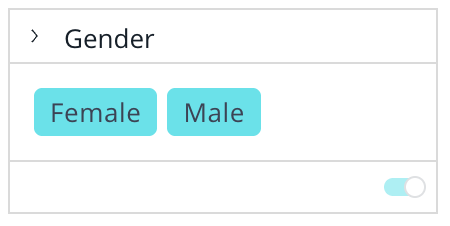

# Class FilterTile

UI component that renders a filter tile based on filter type

## Example

Here’s how to render a filter model as a filter tile.
```vue
<script setup lang="ts">
import { ref } from 'vue';
import { FilterTile } from '@ethings-os/sdk-ui-vue';
import { filterFactory, type Filter } from '@ethings-os/sdk-data';
import * as DM from '../assets/sample-ecommerce-model.js';

const filter = ref<Filter>(filterFactory.members(DM.Commerce.Gender, ['Male', 'Female']));
const handleFilterChange = (updatedFilter: Filter | null) => {
 if (updatedFilter) {
   filter.value = updatedFilter;
 }
};
</script>

<template>
 <FilterTile :filter="filter" :onChange="handleFilterChange" />
</template>
```


## Param

FilterTile props

## Properties

### defaultDataSource

> **`readonly`** **defaultDataSource**?: [`DataSource`](../../sdk-data/type-aliases/type-alias.DataSource.md)

Default data source used for filter tiles

***

### filter

> **`readonly`** **filter**: [`Filter`](../../sdk-data/interfaces/interface.Filter.md)

Filter to display

***

### onChange

> **`readonly`** **onChange**: (`filter`) => `void`

Callback to handle filter change

#### Parameters

| Parameter | Type |
| :------ | :------ |
| `filter` | [`Filter`](../../sdk-data/interfaces/interface.Filter.md) \| `null` |

#### Returns

`void`

***

### onDelete

> **`readonly`** **onDelete**?: () => `void`

Filter delete callback

#### Returns

`void`

***

### onEdit

> **`readonly`** **onEdit**?: (`levelIndex`?) => `void`

Filter edit callback

#### Parameters

| Parameter | Type | Description |
| :------ | :------ | :------ |
| `levelIndex`? | `number` | Index of the filter level that triggers the onEdit action (in the case of a CascadingFilter) |

#### Returns

`void`
