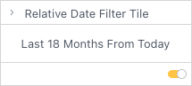

# Class RelativeDateFilterTile

Relative Date Filter Tile component for filtering data by relative date.

## Example

Vue example of configuring the date min max values and handling onUpdate event.
```vue
<template>
  <RelativeDateFilterTile
    :title="relativeDateFilter.title"
    :filter="relativeDateFilter.filter"
    :arrangement="relativeDateFilter.arrangement"
    :onUpdate="relativeDateFilter.onUpdate"
  />
</template>

<script setup lang="ts">
import { ref } from 'vue';
import { RelativeDateFilterTile, type RelativeDateFilterTileProps } from '@sisense/sdk-ui-vue';
import { filterFactory } from '@sisense/sdk-data';
import * as DM from '../assets/sample-retail-model';

const relativeDateFilterValue = ref<Filter | null>(filterFactory.dateRelativeTo(DM.DimDate.Date.Months, 0, 18));

const relativeDateFilter = ref<RelativeDateFilterTileProps>({
  title: 'Relative Date Filter Tile',
  filter: relativeDateFilterValue.value!,
  arrangement: 'vertical',
  onUpdate(filter) {
    relativeDateFilterValue.value = filter;
  },
});
</script>
```


## Param

RelativeDateFilterTile props

## Properties

### arrangement

> **`readonly`** **arrangement**?: [`FilterVariant`](../type-aliases/type-alias.FilterVariant.md)

Arrangement of the filter inputs. Use vertical for standard filter tiles and horizontal for toolbars

***

### filter

> **`readonly`** **filter**: [`Filter`](../../sdk-data/interfaces/interface.Filter.md)

Relative date filter.

***

### limit

> **`readonly`** **limit**?: `object`

Limit of the date range that can be selected.

#### Type declaration

> ##### `limit.maxDate`
>
> **maxDate**: `string`
>
> ##### `limit.minDate`
>
> **minDate**: `string`
>
>

***

### onDelete

> **`readonly`** **onDelete**?: () => `void`

Filter delete callback

#### Returns

`void`

***

### onEdit

> **`readonly`** **onEdit**?: () => `void`

Filter edit callback

#### Returns

`void`

***

### onUpdate

> **`readonly`** **onUpdate**: (`filter`) => `void`

Callback function that is called when the relative date filter object should be updated.

#### Parameters

| Parameter | Type |
| :------ | :------ |
| `filter` | [`Filter`](../../sdk-data/interfaces/interface.Filter.md) |

#### Returns

`void`

***

### title

> **`readonly`** **title**: `string`

Filter tile title
