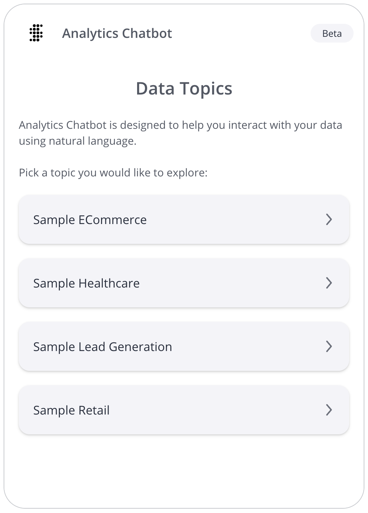

# Class Chatbot

An Vue component that renders a chatbot with data topic selection.

## Example

Here's how you can use the Chatbot component in a Vue application:
```vue
<script setup lang="ts">
import { Chatbot, type ChatbotProps } from '@sisense/sdk-ui-vue/ai';

const chatbotProps: ChatbotProps = {
 width: 500,
 height: 700,
 config: {
   numOfRecommendations: 5,
 },
};
</script>

<template>
 <Chatbot
   :width="chatbotProps.width"
   :height="chatbotProps.height"
   :config="chatbotProps.config"
 />
</template>
```



## Param

[ChatbotProps](../interfaces/interface.ChatbotProps.md)

## Properties

### config

> **`readonly`** **config**?: `Partial`\< [`ChatConfig`](../interfaces/interface.ChatConfig.md) \>

Various configuration options for the chatbot

***

### height

> **`readonly`** **height**?: `Height`\< `number` \| `string` \>

Total height of the chatbot

If not specified, a default height of `900px` will be used.

***

### width

> **`readonly`** **width**?: `Width`\< `number` \| `string` \>

Total width of the chatbot

If not specified, a default width of `500px` will be used.
