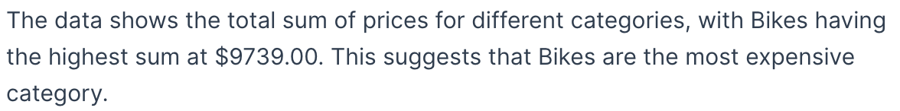

# Class GetNlgInsights

A Vue component that fetches and displays a collapsible analysis of the provided query using natural language generation (NLG).
Specifying a query is similar to providing parameters to a [`useExecuteQuery`](../queries/function.useExecuteQuery.md) composable, using dimensions, measures, and filters.

## Example

Here's how you can use the GetNlgInsights component in a Vue application:
```vue
<script setup lang="ts">
import { GetNlgInsights, type GetNlgInsightsProps } from '@ethings-os/sdk-ui-vue/ai';
import { measureFactory } from '@ethings-os/sdk-data';
import * as DM from '../assets/sample-retail-model';

const props: GetNlgInsightsProps = {
 dataSource: DM.DataSource.title,
 dimensions: [DM.DimProducts.CategoryName],
 measures: [measureFactory.sum(DM.DimProducts.Price)],
};
</script>

<template>
 <GetNlgInsights
   :dataSource="props.dataSource"
   :dimensions="props.dimensions"
   :measures="props.measures"
 />
</template>
```


## Param

[GetNlgInsightsProps](../interfaces/interface.GetNlgInsightsProps.md)

## Properties

### dataSource

> **`readonly`** **dataSource**: [`DataSource`](../../sdk-data/type-aliases/type-alias.DataSource.md)

The data source that the query targets - e.g. `Sample ECommerce`

***

### dimensions

> **`readonly`** **dimensions**?: [`Attribute`](../../sdk-data/interfaces/interface.Attribute.md)[]

Dimensions of the query

***

### filters

> **`readonly`** **filters**?: [`FilterRelations`](../../sdk-data/interfaces/interface.FilterRelations.md) \| [`Filter`](../../sdk-data/interfaces/interface.Filter.md)[]

Filters of the query

***

### measures

> **`readonly`** **measures**?: [`Measure`](../../sdk-data/interfaces/interface.Measure.md)[]

Measures of the query

***

### verbosity

> **`readonly`** **verbosity**?: `"High"` \| `"Low"`

The verbosity of the NLG summarization
