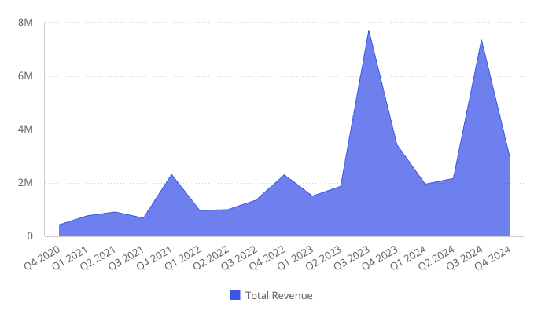
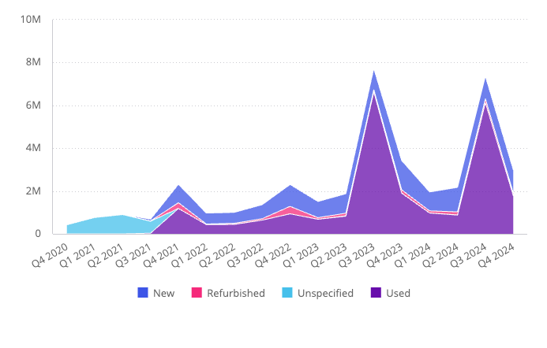
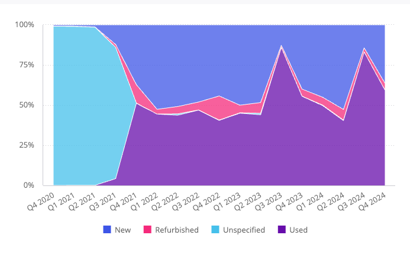

# Function AreaChart

> **AreaChart**(`props`): `Promise`\< `ReactNode` \> \| `ReactNode`

A React component similar to a [`LineChart`](function.LineChart.md),
but with filled in areas under each line and an option to display them as stacked.

## Parameters

| Parameter | Type | Description |
| :------ | :------ | :------ |
| `props` | [`AreaChartProps`](../interfaces/interface.AreaChartProps.md) | Area chart properties |

## Returns

`Promise`\< `ReactNode` \> \| `ReactNode`

Area Chart component

## Example

Area chart displaying total revenue per quarter from the Sample ECommerce data model.

```ts
import { AreaChart } from '@sisense/sdk-ui';
import { measureFactory } from '@sisense/sdk-data';
import * as DM from './sample-ecommerce';

const CodeExample = () => (
  <AreaChart
    dataSet={DM.DataSource}
    dataOptions={{
      category: [DM.Commerce.Date.Quarters],
      value: [measureFactory.sum(DM.Commerce.Revenue, 'Total Revenue')],
      breakBy: [],
    }}
  />
);

export default CodeExample;
```



Stacked area chart variant, broken down by condition:

```ts
<AreaChart
  dataSet={DM.DataSource}
  dataOptions={{
    category: [DM.Commerce.Date.Quarters],
    value: [measureFactory.sum(DM.Commerce.Revenue, 'Total Revenue')],
    breakBy: [DM.Commerce.Condition],
  }}
  styleOptions={{ subtype: 'area/stacked' }}
/>
```



Stacked percentage area chart variant, using the same data:

```ts
<AreaChart
  dataSet={DM.DataSource}
  dataOptions={{
    category: [DM.Commerce.Date.Quarters],
    value: [measureFactory.sum(DM.Commerce.Revenue, 'Total Revenue')],
    breakBy: [DM.Commerce.Condition],
  }}
  styleOptions={{ subtype: 'area/stacked100' }}
/>
```


