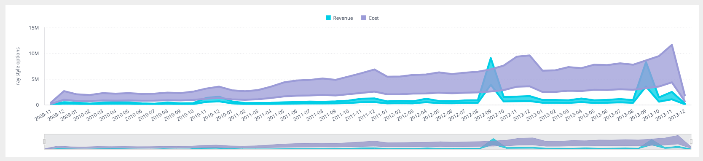

# Function AreaRangeChart <Badge type="beta" text="Beta" />

> **AreaRangeChart**(`props`): `null` \| `ReactElement`\< `any`, `any` \>

A React component that displays a range of data over a given time period or across multiple categories.
It is particularly useful for visualizing the minimum and maximum values in a dataset, along with the area between these values.

## Parameters

| Parameter | Type | Description |
| :------ | :------ | :------ |
| `props` | [`AreaRangeChartProps`](../interfaces/interface.AreaRangeChartProps.md) | Area Range chart properties |

## Returns

`null` \| `ReactElement`\< `any`, `any` \>

Area Range Chart component

## Example

An example of using the component to visualize the `Sample ECommerce` data source:
```ts
    <AreaRangeChart
      dataSet={DM.DataSource}
      dataOptions={{
        category: [DM.Commerce.Date.Months],
        value: [
          {
            title: 'Revenue',
            upperBound: measureFactory.multiply(
              measureFactory.sum(DM.Commerce.Revenue, 'Lower Revenue'),
              0.6,
            ),
            lowerBound: measureFactory.multiply(
              measureFactory.sum(DM.Commerce.Revenue, 'Upper Revenue'),
              1.4,
            ),
          },
          {
            title: 'Cost',
            upperBound: measureFactory.multiply(
              measureFactory.sum(DM.Commerce.Cost, 'Lower Cost'),
              0.9,
            ),
            lowerBound: measureFactory.multiply(
              measureFactory.sum(DM.Commerce.Cost, 'Upper Cost'),
              2.4,
            ),
          },
        ],
        breakBy: [],
      }}
      styleOptions={{
        legend: {
          enabled: true,
          position: 'top',
        },
        lineWidth: {
          width: 'thick',
        },
        yAxis: {
          title: {
            enabled: true,
            text: 'ray style options',
          },
          enabled: true,
          gridLines: true,
          logarithmic: false,
        },
      }}
    />
```


