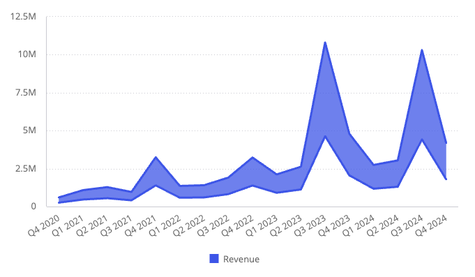
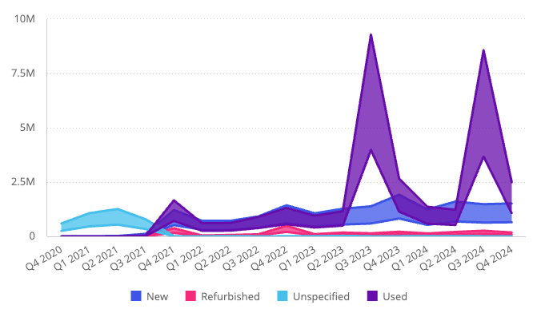

# Function AreaRangeChart

> **AreaRangeChart**(`props`): `Promise`\< `ReactNode` \> \| `ReactNode`

A React component that displays a range of data over a given time period or across multiple categories.
It is particularly useful for visualizing the minimum and maximum values in a dataset, along with the area between these values.

## Parameters

| Parameter | Type | Description |
| :------ | :------ | :------ |
| `props` | [`AreaRangeChartProps`](../interfaces/interface.AreaRangeChartProps.md) | Area Range chart properties |

## Returns

`Promise`\< `ReactNode` \> \| `ReactNode`

Area Range Chart component

## Example

Area range chart displaying total revenue per quarter from the Sample ECommerce data model,
with the range spanning 60%-140% of the actual revenue.

```ts
import { AreaRangeChart } from '@sisense/sdk-ui';
import { measureFactory } from '@sisense/sdk-data';
import * as DM from './sample-ecommerce';

const CodeExample = () => (
  <AreaRangeChart
    dataSet={DM.DataSource}
    dataOptions={{
      category: [DM.Commerce.Date.Quarters],
      value: [
        {
          title: 'Revenue',
          upperBound: measureFactory.multiply(measureFactory.sum(DM.Commerce.Revenue), 1.4, 'Upper Revenue'),
          lowerBound: measureFactory.multiply(measureFactory.sum(DM.Commerce.Revenue), 0.6, 'Lower Revenue'),
        },
      ],
      breakBy: [],
    }}
  />
);

export default CodeExample;
```



The same range broken down by condition:

```ts
<AreaRangeChart
  dataSet={DM.DataSource}
  dataOptions={{
    category: [DM.Commerce.Date.Quarters],
    value: [
      {
        title: 'Revenue',
        upperBound: measureFactory.multiply(measureFactory.sum(DM.Commerce.Revenue), 1.4, 'Upper Revenue'),
        lowerBound: measureFactory.multiply(measureFactory.sum(DM.Commerce.Revenue), 0.6, 'Lower Revenue'),
      },
    ],
    breakBy: [DM.Commerce.Condition],
  }}
/>
```


