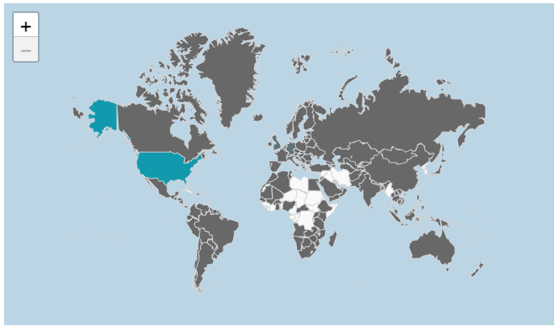

# Function AreamapChart

> **AreamapChart**(`props`): `Promise`\< `ReactNode` \> \| `ReactNode`

A React component for visualizing geographical data as colored polygons on a map.

For another way do display data on a map, see [`ScattermapChart`](function.ScattermapChart.md).

## Parameters

| Parameter | Type | Description |
| :------ | :------ | :------ |
| `props` | [`AreamapChartProps`](../interfaces/interface.AreamapChartProps.md) | Areamap chart properties |

## Returns

`Promise`\< `ReactNode` \> \| `ReactNode`

Areamap Chart component

## Example

Areamap chart displaying total revenue per country from the Sample ECommerce data model. The total revenue amount is indicated by the colors on the map.

```ts
import { AreamapChart } from '@sisense/sdk-ui';
import { measureFactory } from '@sisense/sdk-data';
import * as DM from './sample-ecommerce';

const CodeExample = () => (
  <AreamapChart
    dataSet={DM.DataSource}
    dataOptions={{
      geo: [DM.Country.Country],
      color: [measureFactory.sum(DM.Commerce.Revenue, 'Total Revenue')],
    }}
    styleOptions={{ mapType: 'world' }}
  />
);

export default CodeExample;
```


