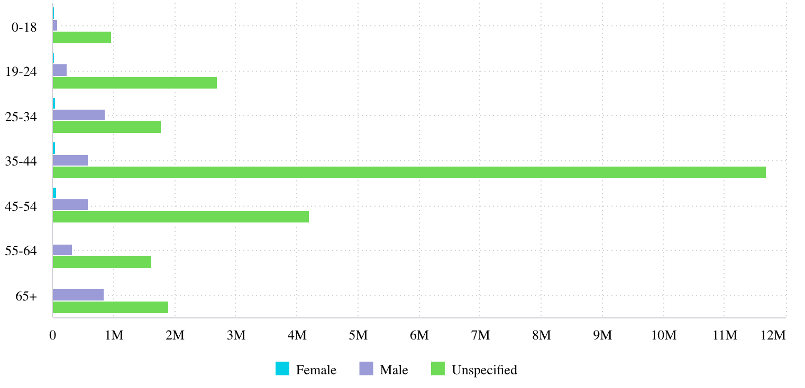

# Function BarChart

> **BarChart**(`props`, `context`?): `null` \| `ReactElement`\< `any`, `any` \>

A React component representing categorical data with horizontal rectangular bars,
whose lengths are proportional to the values that they represent.
You can also break up the values by another category or groups.

See [Bar Chart](https://docs.sisense.com/main/SisenseLinux/bar-chart.htm) for more information.

## Parameters

| Parameter | Type | Description |
| :------ | :------ | :------ |
| `props` | [`BarChartProps`](../interfaces/interface.BarChartProps.md) | Bar chart properties |
| `context`? | `any` | - |

## Returns

`null` \| `ReactElement`\< `any`, `any` \>

Bar Chart component

## Example

An example of using the component to visualize the `Sample ECommerce` data source:
```ts
<BarChart
  dataSet={DM.DataSource}
  dataOptions={{
    category: [DM.Commerce.AgeRange],
    value: [measureFactory.sum(DM.Commerce.Revenue)],
    breakBy: [DM.Commerce.Gender],
  }}
  filters={[filterFactory.greaterThan(DM.Commerce.Revenue, 1000)]}
  onDataPointClick={(point, nativeEvent) => {
    console.log('clicked', point, nativeEvent);
  }}
/>
```


