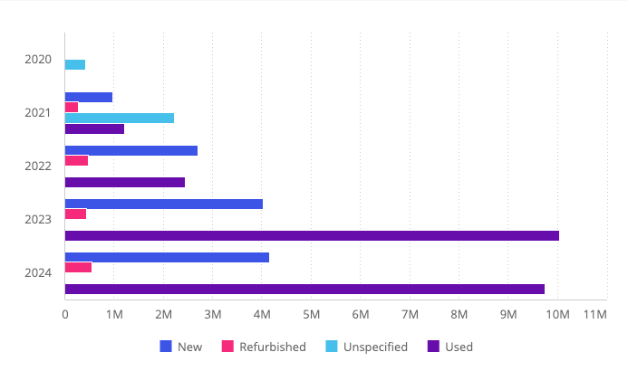
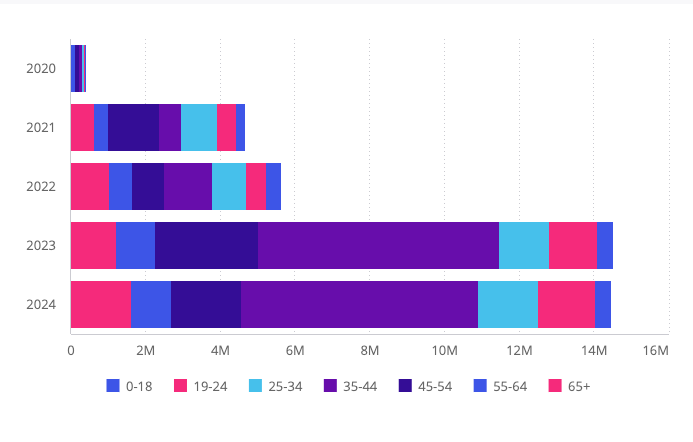
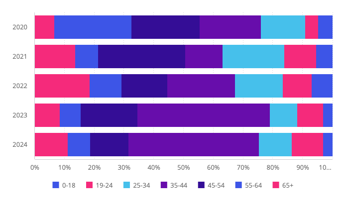

# Function BarChart

> **BarChart**(`props`): `Promise`\< `ReactNode` \> \| `ReactNode`

A React component representing categorical data with horizontal rectangular bars,
whose lengths are proportional to the values that they represent.

## Parameters

| Parameter | Type | Description |
| :------ | :------ | :------ |
| `props` | [`BarChartProps`](../interfaces/interface.BarChartProps.md) | Bar chart properties |

## Returns

`Promise`\< `ReactNode` \> \| `ReactNode`

Bar Chart component

## Example

Bar chart displaying total revenue per year from the Sample ECommerce data model.

```ts
import { BarChart } from '@sisense/sdk-ui';
import { measureFactory } from '@sisense/sdk-data';
import * as DM from './sample-ecommerce';

const CodeExample = () => (
  <BarChart
    dataSet={DM.DataSource}
    dataOptions={{
      category: [DM.Commerce.Date.Years],
      value: [measureFactory.sum(DM.Commerce.Revenue, 'Total Revenue')],
      breakBy: [DM.Commerce.Condition],
    }}
  />
);

export default CodeExample;
```



Stacked bar chart variant, broken down by age range:

```ts
<BarChart
  dataSet={DM.DataSource}
  dataOptions={{
    category: [DM.Commerce.Date.Years],
    value: [measureFactory.sum(DM.Commerce.Revenue, 'Total Revenue')],
    breakBy: [DM.Commerce.AgeRange],
  }}
  styleOptions={{ subtype: 'bar/stacked' }}
/>
```



Stacked percentage bar chart variant, using the same data:

```ts
<BarChart
  dataSet={DM.DataSource}
  dataOptions={{
    category: [DM.Commerce.Date.Years],
    value: [measureFactory.sum(DM.Commerce.Revenue, 'Total Revenue')],
    breakBy: [DM.Commerce.AgeRange],
  }}
  styleOptions={{ subtype: 'bar/stacked100' }}
/>
```


