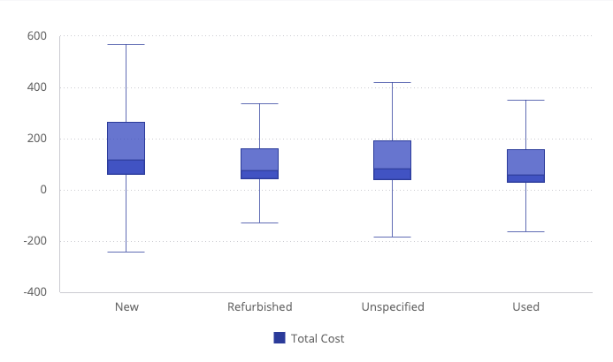

# Function BoxplotChart

> **BoxplotChart**(`props`): `Promise`\< `ReactNode` \> \| `ReactNode`

A React component representing data in a way that visually describes the distribution,
variability, and center of a data set along an axis.

## Parameters

| Parameter | Type | Description |
| :------ | :------ | :------ |
| `props` | [`BoxplotChartProps`](../interfaces/interface.BoxplotChartProps.md) | Boxplot chart properties |

## Returns

`Promise`\< `ReactNode` \> \| `ReactNode`

Boxplot Chart component

## Example

Boxplot chart displaying data from the Sample ECommerce data model.

```ts
import { BoxplotChart } from '@sisense/sdk-ui';
import * as DM from './sample-ecommerce';

const CodeExample = () => (
  <BoxplotChart
    dataSet={DM.DataSource}
    dataOptions={{
      category: [DM.Commerce.Condition],
      value: [{ column: DM.Commerce.Cost, name: 'Total Cost' }],
      boxType: 'iqr',
      outliersEnabled: true,
    }}
    styleOptions={{ subtype: 'boxplot/full' }}
  />
);

export default CodeExample;
```


