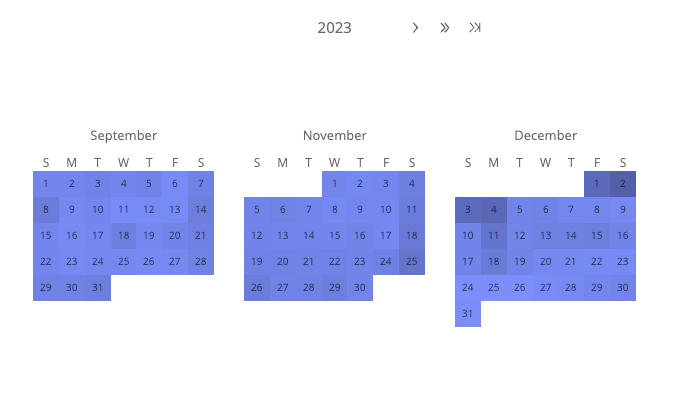

# Function CalendarHeatmapChart

> **CalendarHeatmapChart**(`props`): `Promise`\< `ReactNode` \> \| `ReactNode`

A React component that visualizes values over days in a calendar-like view,
making it easy to identify daily patterns or anomalies

## Parameters

| Parameter | Type | Description |
| :------ | :------ | :------ |
| `props` | [`CalendarHeatmapChartProps`](../interfaces/interface.CalendarHeatmapChartProps.md) | Calendar Heatmap chart properties |

## Returns

`Promise`\< `ReactNode` \> \| `ReactNode`

Calendar Heatmap Chart component

## Example

```ts
import { CalendarHeatmapChart } from '@sisense/sdk-ui';
import { measureFactory } from '@sisense/sdk-data';
import * as DM from './sample-ecommerce';

const CodeExample = () => (
  <CalendarHeatmapChart
    dataSet={DM.DataSource}
    dataOptions={{
      date: DM.Commerce.Date.Days,
      value: { column: measureFactory.sum(DM.Commerce.Quantity, 'Total Quantity') },
    }}
    styleOptions={{ viewType: 'quarter' }}
  />
);

export default CodeExample;
```


