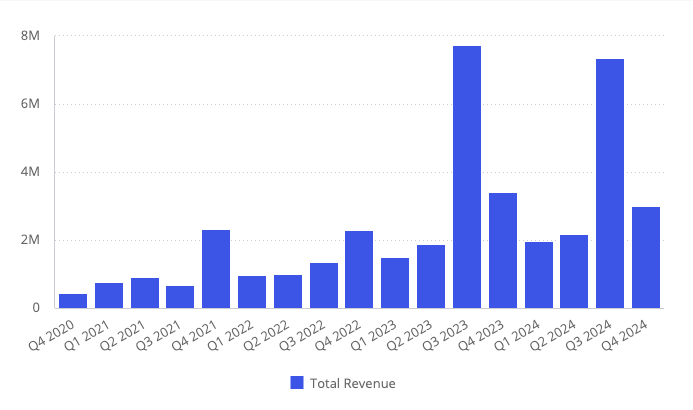

# Function Chart

> **Chart**(`props`): `Promise`\< `ReactNode` \> \| `ReactNode`

A React component used for easily switching chart types or rendering multiple series of different chart types.

## Parameters

| Parameter | Type | Description |
| :------ | :------ | :------ |
| `props` | [`ChartProps`](../interfaces/interface.ChartProps.md) | Chart properties |

## Returns

`Promise`\< `ReactNode` \> \| `ReactNode`

Chart component representing a chart type as specified in `ChartProps.`[chartType](../interfaces/interface.ChartProps.md#charttype)

## Example

A chart component displaying total revenue per quarter from the Sample ECommerce data model. The component is currently set to show the data in a column chart.

```ts
import { Chart } from '@sisense/sdk-ui';
import { measureFactory } from '@sisense/sdk-data';
import * as DM from './sample-ecommerce';

const CodeExample = () => (
  <Chart
    chartType="column" // Change this to "line" to see a line chart
    dataSet={DM.DataSource}
    dataOptions={{
      category: [DM.Commerce.Date.Quarters],
      value: [measureFactory.sum(DM.Commerce.Revenue, 'Total Revenue')],
      breakBy: [],
    }}
  />
);

export default CodeExample;
```


