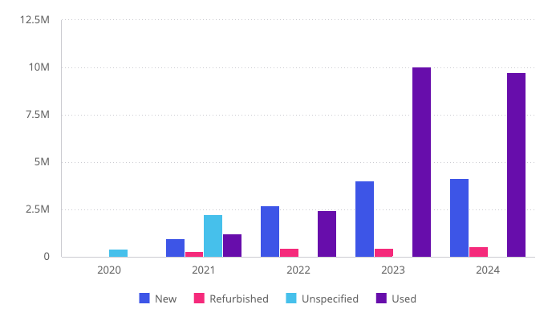
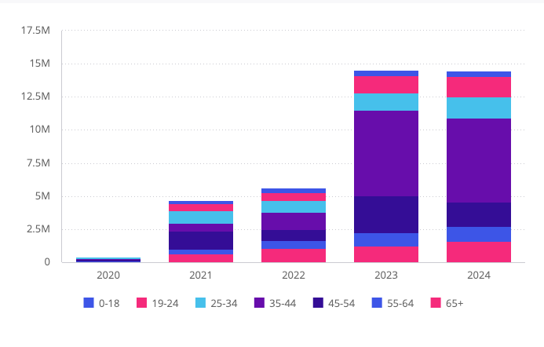
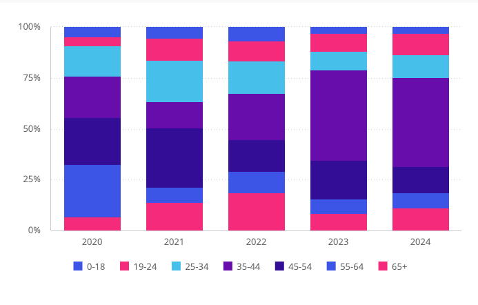

# Function ColumnChart

> **ColumnChart**(`props`): `Promise`\< `ReactNode` \> \| `ReactNode`

A React component representing categorical data with vertical rectangular bars
whose heights are proportional to the values that they represent.

The chart can include multiple values on both the X and Y-axis, as well as a break down by categories displayed on the Y-axis.

## Parameters

| Parameter | Type | Description |
| :------ | :------ | :------ |
| `props` | [`ColumnChartProps`](../interfaces/interface.ColumnChartProps.md) | Column chart properties |

## Returns

`Promise`\< `ReactNode` \> \| `ReactNode`

Column Chart component

## Example

Column chart displaying total revenue per year, broken down by condition, from the Sample ECommerce data model.

```ts
import { ColumnChart } from '@sisense/sdk-ui';
import { measureFactory } from '@sisense/sdk-data';
import * as DM from './sample-ecommerce';

const CodeExample = () => (
  <ColumnChart
    dataSet={DM.DataSource}
    dataOptions={{
      category: [DM.Commerce.Date.Years],
      value: [measureFactory.sum(DM.Commerce.Revenue, 'Total Revenue')],
      breakBy: [DM.Commerce.Condition],
    }}
  />
);

export default CodeExample;
```



Stacked column chart variant, broken down by age range:

```ts
<ColumnChart
  dataSet={DM.DataSource}
  dataOptions={{
    category: [DM.Commerce.Date.Years],
    value: [measureFactory.sum(DM.Commerce.Revenue, 'Total Revenue')],
    breakBy: [DM.Commerce.AgeRange],
  }}
  styleOptions={{ subtype: 'column/stackedcolumn' }}
/>
```



Stacked percentage column chart variant, using the same data:

```ts
<ColumnChart
  dataSet={DM.DataSource}
  dataOptions={{
    category: [DM.Commerce.Date.Years],
    value: [measureFactory.sum(DM.Commerce.Revenue, 'Total Revenue')],
    breakBy: [DM.Commerce.AgeRange],
  }}
  styleOptions={{ subtype: 'column/stackedcolumn100' }}
/>
```


