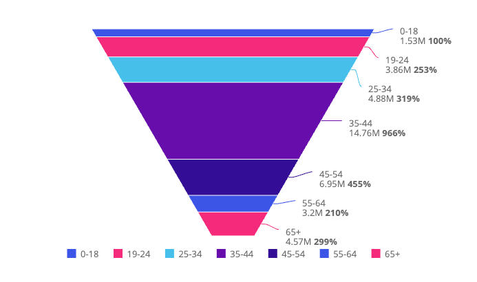

# Function FunnelChart

> **FunnelChart**(`props`): `Promise`\< `ReactNode` \> \| `ReactNode`

A React component representing data progressively decreasing in size or quantity through a funnel shape.

## Parameters

| Parameter | Type | Description |
| :------ | :------ | :------ |
| `props` | [`FunnelChartProps`](../interfaces/interface.FunnelChartProps.md) | Funnel chart properties |

## Returns

`Promise`\< `ReactNode` \> \| `ReactNode`

Funnel Chart component

## Example

Funnel chart displaying data from the Sample ECommerce data model.

```ts
import { FunnelChart } from '@sisense/sdk-ui';
import { measureFactory } from '@sisense/sdk-data';
import * as DM from './sample-ecommerce';

const CodeExample = () => (
  <FunnelChart
    dataSet={DM.DataSource}
    dataOptions={{
      category: [DM.Commerce.AgeRange],
      value: [measureFactory.sum(DM.Commerce.Revenue, 'Total Revenue')],
    }}
    styleOptions={{
      funnelType: 'regular',
      funnelSize: 'regular',
      funnelDirection: 'regular',
    }}
  />
);

export default CodeExample;
```


