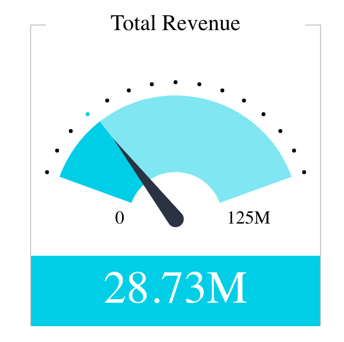

# Function IndicatorChart

> **IndicatorChart**(`props`, `context`?): `null` \| `ReactElement`\< `any`, `any` \>

A React component that provides various options for displaying one or two numeric values as a number, gauge or ticker.
See [Indicator](https://docs.sisense.com/main/SisenseLinux/indicator.htm) for more information.

## Parameters

| Parameter | Type | Description |
| :------ | :------ | :------ |
| `props` | [`IndicatorChartProps`](../interfaces/interface.IndicatorChartProps.md) | Indicator chart properties |
| `context`? | `any` | - |

## Returns

`null` \| `ReactElement`\< `any`, `any` \>

Indicator Chart component

## Example

An example of using the component to visualize the `Sample ECommerce` data source:
```ts
<IndicatorChart
  dataSet={DM.DataSource}
  dataOptions={{
    value: [
      {
        column: measureFactory.sum(DM.Commerce.Revenue),
        numberFormatConfig: {
          name: 'Numbers',
          decimalScale: 2,
          trillion: true,
          billion: true,
          million: true,
          kilo: true,
          thousandSeparator: true,
          prefix: false,
          symbol: '$',
        },
      },
    ],
    secondary: [],
    min: [measureFactory.constant(0)],
    max: [measureFactory.constant(125000000)],
  }}
  filters={[filterFactory.greaterThan(DM.Commerce.Revenue, 1000)]}
  styleOptions={{
    indicatorComponents: {
      title: {
        shouldBeShown: true,
        text: 'Total Revenue',
      },
      secondaryTitle: {
        text: '',
      },
      ticks: {
        shouldBeShown: true,
      },
      labels: {
        shouldBeShown: true,
      },
    },
    subtype: 'indicator/gauge',
    skin: 1,
  }}
/>
```


