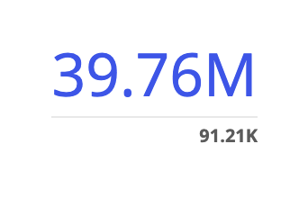
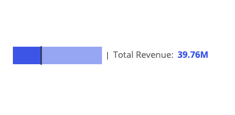

# Function IndicatorChart

> **IndicatorChart**(`props`): `Promise`\< `ReactNode` \> \| `ReactNode`

A React component that provides various options for displaying one or two numeric values as a number, gauge or ticker.

## Parameters

| Parameter | Type | Description |
| :------ | :------ | :------ |
| `props` | [`IndicatorChartProps`](../interfaces/interface.IndicatorChartProps.md) | Indicator chart properties |

## Returns

`Promise`\< `ReactNode` \> \| `ReactNode`

Indicator Chart component

## Example

```ts
import { IndicatorChart } from '@sisense/sdk-ui';
import { measureFactory } from '@sisense/sdk-data';
import * as DM from './sample-ecommerce';

const CodeExample = () => (
  <IndicatorChart
    dataSet={DM.DataSource}
    dataOptions={{
      value: [measureFactory.sum(DM.Commerce.Revenue, 'Total Revenue')],
      max: [measureFactory.constant(125000000)],
    }}
    styleOptions={{
      indicatorComponents: {
        title: { shouldBeShown: true, text: 'Total Revenue' },
        ticks: { shouldBeShown: false },
        labels: { shouldBeShown: true },
      },
      subtype: 'indicator/gauge',
      skin: 2,
    }}
  />
);

export default CodeExample;
```


Numeric indicator variant with a secondary value:

```ts
<IndicatorChart
  dataSet={DM.DataSource}
  dataOptions={{
    value: [measureFactory.sum(DM.Commerce.Revenue, 'Total Revenue')],
    // secondary value is optional
    secondary: [measureFactory.sum(DM.Commerce.Quantity, 'Total Quantity')],
  }}
/>
```



Ticker style indicator variant:

```ts
<IndicatorChart
  dataSet={DM.DataSource}
  dataOptions={{
    value: [measureFactory.sum(DM.Commerce.Revenue, 'Total Revenue')],
    max: [measureFactory.constant(125000000)],
  }}
  styleOptions={{
    indicatorComponents: {
      title: { shouldBeShown: true, text: 'Total Revenue' },
      ticks: { shouldBeShown: false },
      labels: { shouldBeShown: true },
    },
    subtype: 'indicator/gauge',
    skin: 2,
    forceTickerView: true,
    tickerBarHeight: 30,
    width: 400,
  }}
/>
```


